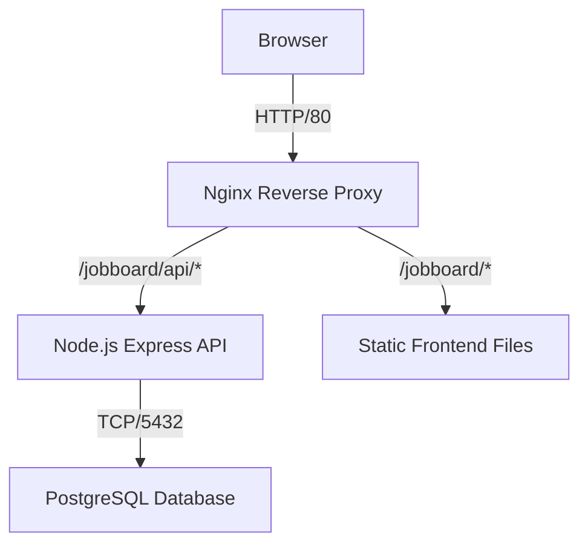

# Design System & Architecture

## Architecture Overview

The application uses a **Client-Server-Database** architecture with Docker containers, featuring multiple Kanban boards and a unified navigation system.

### Components

1. **Frontend (Public)**: Vanilla JS SPA with three main views
   - Dashboard (home)
   - Job Board (Kanban)
   - Business Board (Kanban)
2. **API (Server)**: Express.js application handling Auth, Jobs, Business, Dashboard
3. **Database (Persistence)**: PostgreSQL storing Users, Jobs, and Business Entities
4. **Gateway (Nginx)**: Handles routing, static file serving, and API proxying

## Data Model

### Database Schema

#### `users` Table
| Field | Type | Description |
|-------|------|-------------|
| `id` | SERIAL | Primary Key |
| `email` | VARCHAR | Unique, login identifier |
| `password_hash` | VARCHAR | Bcrypt hashed password |
| `created_at` | TIMESTAMP | Account creation date |

#### `jobs` Table
| Field | Type | Description |
|-------|------|-------------|
| `id` | SERIAL | Primary Key |
| `user_id` | INTEGER | FK → users.id (Isolation) |
| `type` | VARCHAR | 'job' or 'connection' |
| `rating` | INTEGER | 1-5 Priority |
| `status` | VARCHAR | interested, applied, forgotten, interview, offer, rejected |
| `origin` | VARCHAR | 'human' or 'agent' |
| `is_unseen` | BOOLEAN | True if agent-created & not viewed |
| `company` | VARCHAR | |
| `position` | VARCHAR | |
| `contact_name` | VARCHAR | (Mapped to `contactName` in API) |
| `location` | VARCHAR | |
| `salary` | VARCHAR | |
| `comments` | TEXT | Markdown notes |
| `created_at` | TIMESTAMP | |
| `updated_at` | TIMESTAMP | Auto-updates via trigger |

#### `business_entities` Table
| Field | Type | Description |
|-------|------|-------------|
| `id` | SERIAL | Primary Key |
| `user_id` | INTEGER | FK → users.id (Isolation) |
| `name` | VARCHAR | Entity name |
| `type` | VARCHAR | investor, vc, accelerator, connection |
| `status` | VARCHAR | researching, contacted, meeting, negotiation, signed, rejected |
| `contact_person` | VARCHAR | |
| `email` | VARCHAR | |
| `website` | VARCHAR | |
| `location` | VARCHAR | |
| `notes` | TEXT | |
| `created_at` | TIMESTAMP | |
| `updated_at` | TIMESTAMP | |

## API Design

### Authentication (JWT)
- **POST /auth/signup**: Create account → Return Token
- **POST /auth/login**: Validate creds → Return Token
- **Token Storage**: Client stores JWT in `localStorage.authToken`
- **Security**: Passwords hashed with `bcrypt`. Rate limited (5 req/15min).

### Endpoints

#### Jobs
| Method | Endpoint | Description |
|--------|----------|-------------|
| GET | `/api/jobs` | Fetch all jobs for user |
| POST | `/api/jobs` | Create new job |
| PUT | `/api/jobs/:id` | Update job |
| DELETE | `/api/jobs/:id` | Delete job |

#### Business Entities
| Method | Endpoint | Description |
|--------|----------|-------------|
| GET | `/api/business` | Fetch all entities for user |
| POST | `/api/business` | Create new entity |
| PUT | `/api/business/:id` | Update entity |
| DELETE | `/api/business/:id` | Delete entity |

#### Dashboard
| Method | Endpoint | Description |
|--------|----------|-------------|
| GET | `/api/dashboard/summary` | Get interviews + new AI matches |

*Note: All data endpoints require `Authorization: Bearer <token>` header.*

## Design System (UI)

Aurora Design System - Modern, clean aesthetic with color-coded status columns.

### Status Colors - Job Board
| Status | Color | Hex |
|--------|-------|-----|
| Interested | Purple | #A855F7 |
| Applied | Blue | #3B82F6 |
| Interview | Amber | #F59E0B |
| Offer | Green | #22C55E |
| Rejected | Slate | #64748B |
| Forgotten | Gray | #9CA3AF |

### Status Colors - Business Board
| Status | Color | Hex |
|--------|-------|-----|
| Researching | Indigo | #6366F1 |
| Contacted | Cyan | #0891B2 |
| Meeting | Violet | #8B5CF6 |
| Negotiation | Orange | #EA580C |
| Signed | Emerald | #059669 |
| Rejected | Slate | #64748B |

### Entity Type Icons
| Type | Icon |
|------|------|
| Job | 💼 |
| Connection (Job Board) | 🤝 |
| Investor | 💸 |
| VC | 🏛️ |
| Accelerator | 🚀 |
| Connection (Business) | 🤝 |

### Navigation
- **Left Sidebar**: Consistent across all pages
- **Active Page**: Highlighted with accent color
- **User Profile**: Displayed in sidebar footer
- **Logout**: Confirmation modal

### UX Patterns
- **Immediate Feedback**: Optimistic UI updates
- **Error Handling**: Non-blocking alerts
- **View Toggle**: Compact/Comfortable persists per board
- **Drag & Drop**: Status changes via column drops
- **Color Coding**: Visual status indicators on column headers
