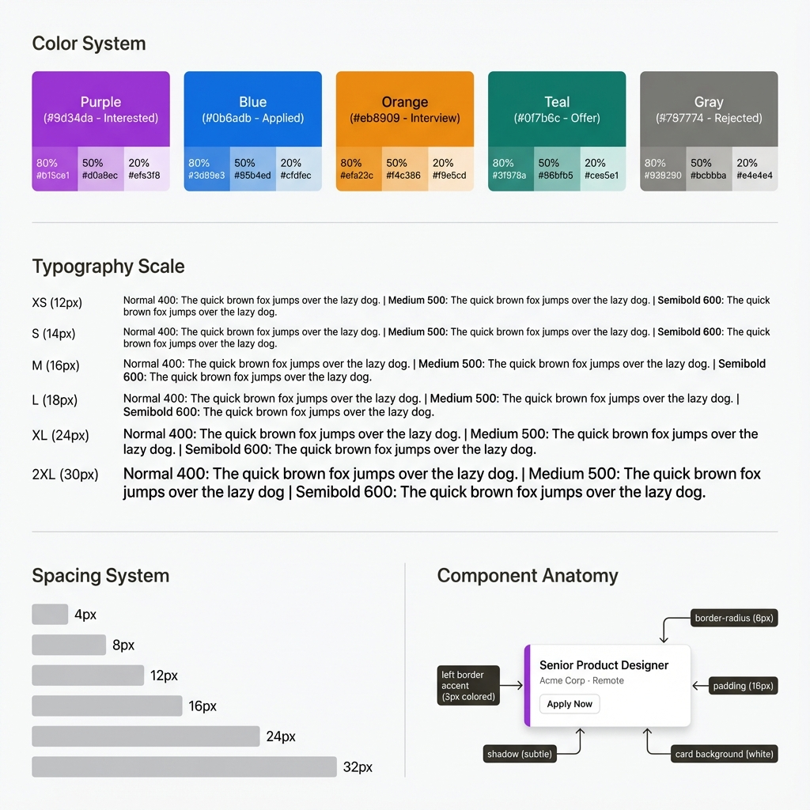
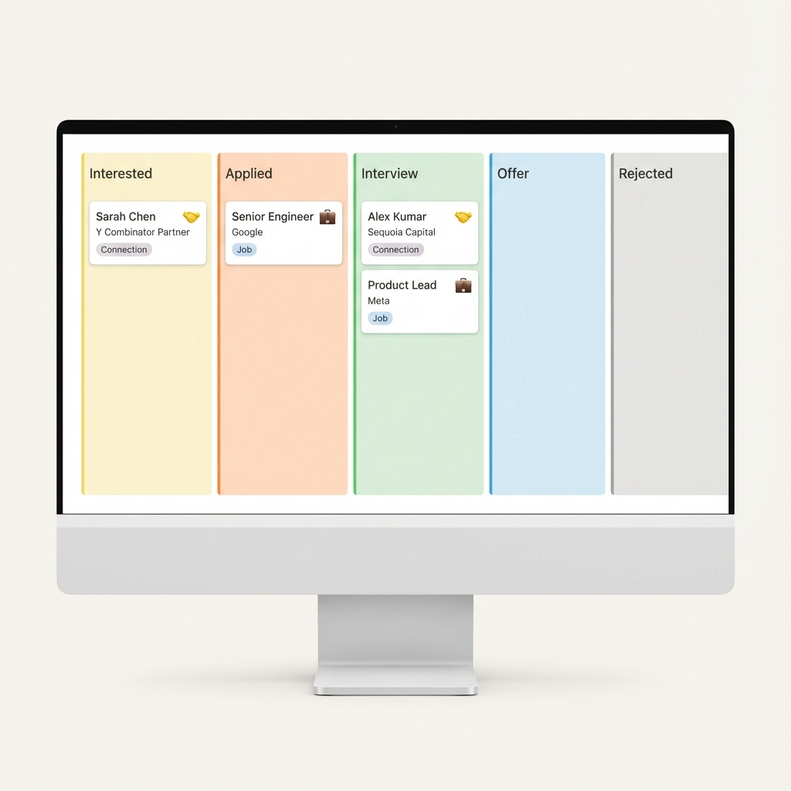

# Design System

Minimalist Notion-inspired design for the personal job board.





## Colors

### Base
- Background: `#f7f6f3` (warm off-white)
- Border: `#e3e2df`
- Text: `#37352f` (dark), `#787774` (gray)
- Accent: `#2383e2` (blue)

### Status
- Interested: `#9d34da` (purple)
- Applied: `#0b6adb` (blue)
- Forgotten: `#9e8b6e` (muted amber)
- Interview: `#eb8909` (orange)
- Offer: `#0f7b6c` (teal)
- Rejected: `#787774` (gray)
- Star Rating: `#FFB800` (gold)

## Typography

- **Font**: System UI (-apple-system, SF Pro, Segoe UI)
- **Sizes**: 12px - 30px
- **Weights**: 400 (normal), 500 (medium), 600 (semibold)

## Spacing

4px increments: 4px (xs), 8px (sm), 12px (md), 16px (lg), 24px (xl), 32px (2xl)

## Components

### Cards
- White background, 6px radius
- 3px colored left border (status color)
- Hover: lift 2px + shadow
- **Header**: Stars (left) + Type badge (right)

### Type Badges
- 🤝 Connection (purple tint) | 💼 Job (blue tint)

### Star Rating
- **Display**: Gold filled (★), gray empty (☆), 14px
- **Input**: 5 clickable stars (24px), JavaScript highlights

### View Toggle
- **Button**: Icon button in header (⊟/⊞)
- **Comfortable mode** (⊟): Full padding (16px), multi-line layout, larger fonts
- **Compact mode** (⊞): Reduced padding (8px), inline layout, ~50% height reduction
- **Persistence**: View preference saved to localStorage

### Markdown Comments
- **Library**: marked.js (CDN, ~5KB)
- **Toggle**: Preview/Edit button in detail panel
- **Edit mode**: Standard textarea with markdown syntax
- **Preview mode**: Rendered HTML with styled markdown
- **Supported**: Headings, bold, italic, lists, code blocks, links, blockquotes, horizontal rules
- **Storage**: Raw markdown saved to localStorage

## Data Model

```javascript
{
  type: "connection" | "job",
  rating: 1-5,  // Star priority
  
  // Core (both types)
  company, position, location, salary,
  
  // Connection-specific
  contactName, organization,
  
  // Common
  status, comments, dateAdded,
  
  // Timestamps (auto-managed)
  created_at,   // Set on creation, never changes
  updated_at    // Updated on every save
}
```

**Connections**: All fields available (contactName + organization optional additions)  
**Jobs**: Core fields only

## Interactions

- Drag-and-drop between columns
- Click card → open lateral panel  
- Hover: cards lift, buttons brighten
- Star click: auto-highlight up to rating
- View toggle: switch between comfortable/compact modes (persists across sessions)
- Markdown toggle: switch between edit and preview for comments (resets to edit when closing panel)
