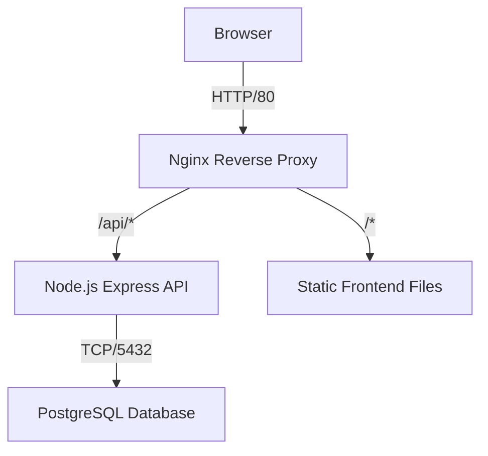

# Design System & Architecture

## Architecture Overview

The application has moved from a client-side only (localStorage) model to a robust **Client-Server-Database** architecture using Docker containers.

### Components

1.  **Frontend (Public)**: Vanilla JS SPA. Fetches data via REST API.
2.  **API (Server)**: Express.js application handling Auth and CRUD.
3.  **Database (Persistence)**: PostgreSQL storing Users and Jobs.
4.  **Gateway (Nginx)**: Handles routing, static file serving, and CORS.

## Data Model

### Database Schema

#### `users` Table
| Field | Type | Description |
|-------|------|-------------|
| `id` | SERIAL | Primary Key |
| `email` | VARCHAR | Unique, login identifier |
| `password_hash` | VARCHAR | Bcrypt hashed password |
| `created_at` | TIMESTAMP | Account creation date |

#### `jobs` Table
| Field | Type | Description |
|-------|------|-------------|
| `id` | SERIAL | Primary Key |
| `user_id` | INTEGER | FK -> users.id (Isolation) |
| `type` | VARCHAR | 'job' or 'connection' |
| `rating` | INTEGER | 1-5 Priority |
| `status` | VARCHAR | interested, applied, etc. |
| `company` | VARCHAR | |
| `position` | VARCHAR | |
| `contact_name` | VARCHAR | (Mapped to `contactName` in API) |
| `...` | ... | Other fields (location, salary, etc) |

## API Design

### Authentication (JWT)
- **POST /auth/signup**: Create account -> Return Token
- **POST /auth/login**: Validate creds -> Return Token
- **Token Storage**: Client stores JWT in `localStorage`
- **Security**: Passwords hashed with `bcrypt`. API limits rate (5 req/15min).

### Endpoints
- **GET /api/jobs**: Fetch all jobs for *authenticated user*.
- **POST /api/jobs**: Create new job.
- **PUT /api/jobs/:id**: Update job.
- **DELETE /api/jobs/:id**: Delete job.

*Note: All `/api/jobs` endpoints require a valid `Authorization: Bearer <token>` header.*

## Design System (UI)

Minimalist Notion-inspired design.

### Colors
- **Status Colors**: Consistent color mapping for job stages (Purple/Blue/Amber/Orange/Teal/Gray).
- **Dark Mode Compatible**: Variables defined in `root`.

### UX Patterns
- **Immediate Feedback**: Optimistic UI updates where possible.
- **Error Handling**: Non-blocking toast/alert messages.
- **View Toggle**: User preference (Compact/Comfortable) persists across sessions.
