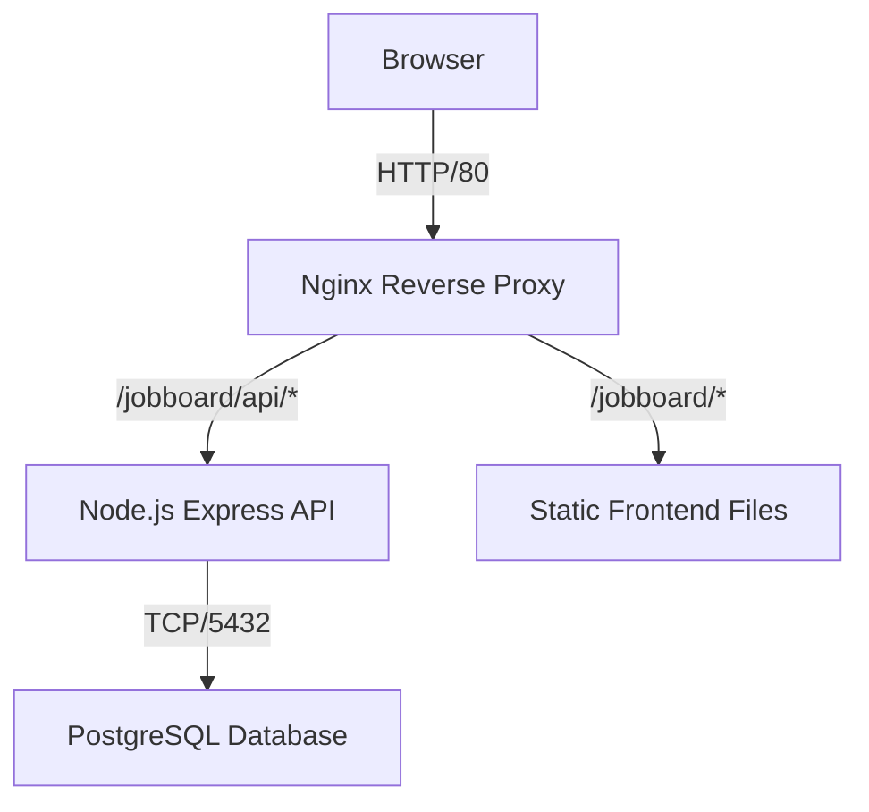

# Design System & Architecture

## Architecture Overview

The application uses a **Client-Server-Database** architecture with Docker containers, featuring multiple Kanban boards and a unified navigation system.

```mermaid
graph TD
    Client[Browser] -->|HTTP/80| Nginx[Nginx Reverse Proxy]
    Nginx -->|/jobboard/api/*| API[Node.js Express API]
    Nginx -->|/jobboard/*| Static[Static Frontend Files]
    API -->|TCP/5432| DB[PostgreSQL Database]
```

### Components

1. **Frontend**: React 19 + TypeScript SPA, built with Vite as a multi-page app
   (one HTML entry per page, each mounting a React root)
   - Dashboard (home)
   - Job Board (Kanban)
   - Business Board (Kanban)
   - Profile, Docs, Login
2. **API (Server)**: Express.js application handling Auth, Jobs, Business, Dashboard
3. **Database (Persistence)**: PostgreSQL storing Users, Jobs, and Business Entities
4. **Gateway (Nginx)**: Handles routing, static file serving, and API proxying

## Data Model

### Database Schema

#### `users` Table
| Field | Type | Description |
|-------|------|-------------|
| `id` | SERIAL | Primary Key |
| `email` | VARCHAR | Unique, login identifier |
| `password_hash` | VARCHAR | Bcrypt hashed password |
| `created_at` | TIMESTAMP | Account creation date |

#### `jobs` Table
| Field | Type | Description |
|-------|------|-------------|
| `id` | SERIAL | Primary Key |
| `user_id` | INTEGER | FK → users.id (Isolation) |
| `type` | VARCHAR | 'job' or 'connection' |
| `rating` | INTEGER | 1-5 Priority |
| `status` | VARCHAR | interested, applied, forgotten, interview, pending, offer, rejected, **archived** |
| `origin` | VARCHAR | 'human' or 'agent' |
| `is_unseen` | BOOLEAN | True if agent-created & not viewed |
| `is_locked` | BOOLEAN | True if job has been transformed/archived |
| `company` | VARCHAR | |
| `position` | VARCHAR | |
| `contact_name` | VARCHAR | (Mapped to `contactName` in API) |
| `location` | VARCHAR | |
| `salary` | VARCHAR | |
| `comments` | TEXT | Markdown notes |
| `created_at` | TIMESTAMP | |
| `updated_at` | TIMESTAMP | Auto-updates via trigger |

#### `business_entities` Table
| Field | Type | Description |
|-------|------|-------------|
| `id` | SERIAL | Primary Key |
| `user_id` | INTEGER | FK → users.id (Isolation) |
| `name` | VARCHAR | Entity name |
| `type` | VARCHAR | investor, vc, accelerator, connection |
| `status` | VARCHAR | researching, contacted, meeting, negotiation, signed, rejected |
| `contact_person` | VARCHAR | |
| `email` | VARCHAR | |
| `website` | VARCHAR | |
| `location` | VARCHAR | |
| `notes` | TEXT | |
| `created_at` | TIMESTAMP | |
| `updated_at` | TIMESTAMP | |

#### `business_entity_files` Table
| Field | Type | Description |
|-------|------|-------------|
| `id` | SERIAL | Primary Key |
| `entity_id` | INTEGER | FK → business_entities.id (CASCADE delete) |
| `filename` | VARCHAR | UUID filename on disk |
| `original_name` | VARCHAR | User's filename |
| `mimetype` | VARCHAR | File type |
| `size` | INTEGER | Bytes |
| `created_at` | TIMESTAMP | |

#### `job_history` Table
| Field | Type | Description |
|-------|------|-------------|
| `id` | SERIAL | Primary Key |
| `job_id` | INTEGER | FK → jobs.id (CASCADE delete) |
| `previous_status` | VARCHAR | Status before change (null on insert) |
| `new_status` | VARCHAR | Status after change |
| `changed_at` | TIMESTAMP | When the change occurred |

## API Design

### Authentication (JWT)
- **POST /auth/signup**: Create account → Return Token
- **POST /auth/login**: Validate creds → Return Token
- **Token Storage**: Client stores JWT in `localStorage.authToken`
- **Security**: Passwords hashed with `bcrypt`. Rate limited (5 req/15min).

### Endpoints

#### Jobs
| Method | Endpoint | Description |
|--------|----------|-------------|
| GET | `/api/jobs` | Fetch all jobs for user |
| POST | `/api/jobs` | Create new job |
| PUT | `/api/jobs/:id` | Update job |
| DELETE | `/api/jobs/:id` | Delete job |
| GET | `/api/jobs/:id/history` | Fetch status change history |

#### Business Entities
| Method | Endpoint | Description |
|--------|----------|-------------|
| GET | `/api/business` | Fetch all entities for user |
| POST | `/api/business` | Create new entity |
| PUT | `/api/business/:id` | Update entity |
| DELETE | `/api/business/:id` | Delete entity |

#### Dashboard
| Method | Endpoint | Description |
|--------|----------|-------------|
| GET | `/api/dashboard/summary` | Get interviews + new AI matches |

*Note: All data endpoints require `Authorization: Bearer <token>` header.*

## Design System (UI)

**IBM Carbon Design System.** Structural, square-cornered, colour-as-meaning. The
full token reference lives in [DESIGN_SYSTEM.md](./DESIGN_SYSTEM.md); this section
covers only how the app consumes it.

### Token Engine

Everything is defined in `src/styles/theme.css`, imported once from `src/main.tsx`,
in two levels:

| Level | What it is | Example | Changes with theme? |
|-------|-----------|---------|---------------------|
| **N1 — Primitives** | The official Carbon palette as raw hex, named after the palette | `--cds-blue-60: #0f62fe` | No |
| **N2 — Semantics** | What a colour is *for*, as `var()` references into N1 | `--cds-text-primary`, `--cds-layer-01` | Yes |

The eight stylesheets in `src/styles/` contain **zero colour literals** and consume
N2 only. A component that reaches for an N1 primitive cannot follow a theme switch,
which is precisely the bug the split prevents.

Alongside colour sit the theme-independent scales: spacing (`--cds-spacing-01`…`13`),
type (families, weights, sizes, line heights, letter spacing, plus composed styles),
radius and elevation.

### Themes

Two themes, selected by a `data-carbon-theme` attribute on `<html>`:

| Theme | Mode | Attribute value |
|-------|------|-----------------|
| **g10** | Light | `g10` (also the default when nothing is stored) |
| **g100** | Dark | `g100` |

- Applied by `src/theme.ts` before React mounts, so there is no flash of the wrong theme.
- Resolution on first load: stored preference wins, otherwise `prefers-color-scheme`.
  After an explicit choice the OS is no longer consulted.
- Persisted to `localStorage.carbonTheme`; the toggle sits at the foot of the Sidebar.

### Typography

**IBM Plex Sans** (UI) and **IBM Plex Mono** (code, IDs, tool output), linked from the
`<head>` of every HTML entry rather than through a CSS `@import`, which would serialise
the font fetch behind the stylesheet. Carbon carries emphasis at weight 600, never 700.

### Status Colors — token triplets

Each board status resolves through three semantic tokens rather than a hex:

| Token | Applied to |
|-------|-----------|
| `--cds-status-<name>` | Column header title and border, card left border |
| `--cds-status-<name>-header` | Column header fill |
| `--cds-status-<name>-surface` | Column body fill |

**Job Board**: `interested` (purple), `applied` (blue), `interview` (yellow),
`pending` (teal), `offer` (green), `rejected` (gray), `forgotten` (gray, one stop darker).

**Business Board**: `researching` (blue), `contacted` (teal), `meeting` (purple),
`negotiation` (red), `signed` (green).

The hue names above are Carbon palette families, not literals. In g10 the accent sits at
the 70 stop with 10/20 fills; in g100 that inverts to a 30 accent with 80/90 fills, so a
status reads at the same strength on either background. Every pair is contrast-checked —
see `scripts/check-tokens.py`.

Beyond the board statuses, `--cds-agent-accent` marks anything the AI produced (agent-origin
card border and pulse), and the support semantics (`--cds-support-error`, `-success`,
`-info`, `-warning`, each with a `-subtle` fill) drive the inline notifications.

### Iconography

No emoji in the UI. Icons are inline SVG React components in `src/components/icons.tsx`,
sized via a `size` prop and inheriting `currentColor` so they follow the theme:

| Type | Component |
|------|-----------|
| Job | `JobBoardIcon` |
| Connection (Job Board) | `BusinessIcon` |
| Investor | `MoneyIcon` |
| VC | `InstitutionIcon` |
| Accelerator | `RocketIcon` |
| Connection (Business) | `HandshakeIcon` |

### Conformance Scripts

| Script | Checks |
|--------|--------|
| `scripts/check-tokens.py` | Token structure, g10/g100 parity (a semantic missing from g100 silently inherits its light value), and WCAG contrast for every text/surface pair in both themes |
| `scripts/audit-undefined-tokens.py` | `var()` references that resolve to nothing — the browser drops the whole declaration silently, so these are live bugs |
| `scripts/find-non-carbon-colors.py <file.css>` | Colour literals, including `rgba()`, and whether each is in the Carbon palette |

### Navigation
- **Left Sidebar**: Consistent across all pages
- **Active Page**: Highlighted with accent color
- **User Profile**: Displayed in sidebar footer
- **Theme Toggle**: Sidebar footer, persists across sessions
- **Logout**: Confirmation modal

### UX Patterns
- **Immediate Feedback**: Optimistic UI updates
- **Error Handling**: Non-blocking alerts
- **View Toggle**: Compact/Comfortable persists per board
- **Drag & Drop**: Status changes via column drops
- **Color Coding**: Visual status indicators on column headers

### File Handling
- **Downloads**:
  - **Safari**: Use `<a download>` *without* `target="_blank"`. Relies on `Content-Disposition: attachment` header.
  - **Chrome**: Use `<a download="filename.ext">` to force correct naming and override internal identifiers.
  - **Backend**: Always sanitize filenames (replace spaces/symbols with underscores) to ensure header compatibility.

### UI Components
- **Confirmation Modals**: Use generic overlay with `confirm/cancel` actions for destructive operations (Delete, Archive, Logout).
- **`Drawer`** (`src/components/Drawer.tsx`): The right-hand editing drawer shell, shared by the Job and Business detail panels. Owns the aside, its positioning, the header with title and close button, and the Escape handler. A `blockedBy` prop lists layers stacked above it (confirmation dialog, file preview) — while any is open, Escape belongs to that layer.
- **`InlineNotification`** (`src/components/InlineNotification.tsx`): Carbon inline notification in four kinds (`error`, `success`, `info`, `warning`) — a subtle fill, a solid status bar down the leading edge, and text that clears AA against that fill. All colour lives in the modifier class; there is no colour prop, so a caller cannot invent a kind that bypasses the contrast checks.

### Feature Workflows

#### Job to Business Transformation
1.  **Trigger**: User clicks "Transform to Connection" on a Job card.
2.  **Confirmation**: Custom modal explains the consequences before proceeding.
3.  **Action**:
    -   Creates a new `Business Entity` from Job data (Company → Name, etc).
    -   Migrates all `Job Files` to `Entity Files`.
    -   Sets `is_locked = TRUE` on the Job (status remains unchanged).
4.  **Result**:
    -   Job card becomes a **Ghost** (readonly, non-draggable) in its original column.
    -   New Business Connection appears in "Researching" column on Business Board.

## Agent & Copilot Architecture

### 1. WebSocket Agent Console
The **Zenith Agent** runs as a separate service communicating with the React SPA over a persistent WebSocket connection:
- **Endpoint**: `/ws?token=<JWT>`
- **Loop**: Listens for user messages/actions and responds with streaming states (`type: 'thinking'` followed by tool executions or chat updates).

### 2. Contextual Onboarding & Interview
- **Dynamic Context**: The agent system prompt is compiled dynamically on every turn. If `profile_data` (experiences, skills, bio) exists, the agent analyzes it to avoid repeating questions.
- **Smart Interviewing**: Focuses questions on missing details, motivators, salary, location, and constraints.

### 3. Strategy Frameworks & Visualizations
- **Schein Career Anchors**: The user's motivators (Lifestyle, Autonomy, etc.) are compiled and visualized via an **SVG Radar Chart** in the Strategy dashboard.
- **Korn Ferry KF4D**: Mapped pillars showing Competencies, Experiences, Traits, and Drivers in a dedicated dashboard view.

### 4. Client-Side Navigation Agent Tool
- **Tool**: `navigate_to`
- **Execution Flow**: When triggered by the user (e.g. *"take me to my experiences"*), the agent invokes `navigate_to` which sends a navigate event to the SPA frontend. The router intercepts this and changes pages without reload.

### 5. Automated Job Search Prompt Generation
- **Goal**: Injects a structured prompt for Claude for Chrome inside the dashboard.
- **Content**: Specifies selection filters (salary, mode, exclusions) and provides a JSON schema (including `url`) with step-by-step instructions for REST API calls and DOM field-filling.

### 6. Last Message Editing & Forking (Bifurcación)
- **UI Interaction**: The last user message in the active chat displays an edit button (`✏️`). Clicking it switches the message to an inline textarea.
  - **Textarea Styles**: To ensure optimal UX and responsiveness, the textarea is styled with `minHeight: 100px`, `maxHeight: none`, `resize: vertical` (allowing manual height expansion), and `overflowY: auto` (allowing internal vertical scrolling).
  - **Actions**: Includes "Guardar y enviar" and "Cancelar" buttons.
- **Backend Flow**: When an `edit_message` WebSocket event is received, the server cancels any active LLM generation for that conversation, updates the content of the edited message in the database, deletes all subsequent messages (`id > messageId`) to purge old context, streams the updated history, and triggers `run_agent_loop` to regenerate the response.

### 7. Real-Time Thinking States
- **Dynamic Progress Feed**: The static `"Pensando..."` state is replaced by dynamic, context-specific strings updated in real-time as the agent loop iterates:
  - Initial Analysis: `"Analizando tu consulta..."`
  - Workspace Tool Execution: `"Procesando resultados de la acción en tu tablero de empleos..."`
  - Memory Management: `"Consolidando preferencias en tu memoria a largo plazo..."`
  - Navigation Redirection: `"Confirmando redirección de pantalla..."`

### 8. Utility Scripts
- **`scripts/reset_agent.sh`**: Completely purges all user profile data, enriched strategies, learned memories, and chat conversations. Sets onboarding status back to `uninitialized`.
- **`scripts/reset_interview.sh`**: Resets only the onboarding interview status back to `interview_pending` and deletes conversations and memories, but **preserves `profile_data` completely intact**. This enables quick, repetitive testing of the dynamic interviewing loop using already populated context.
