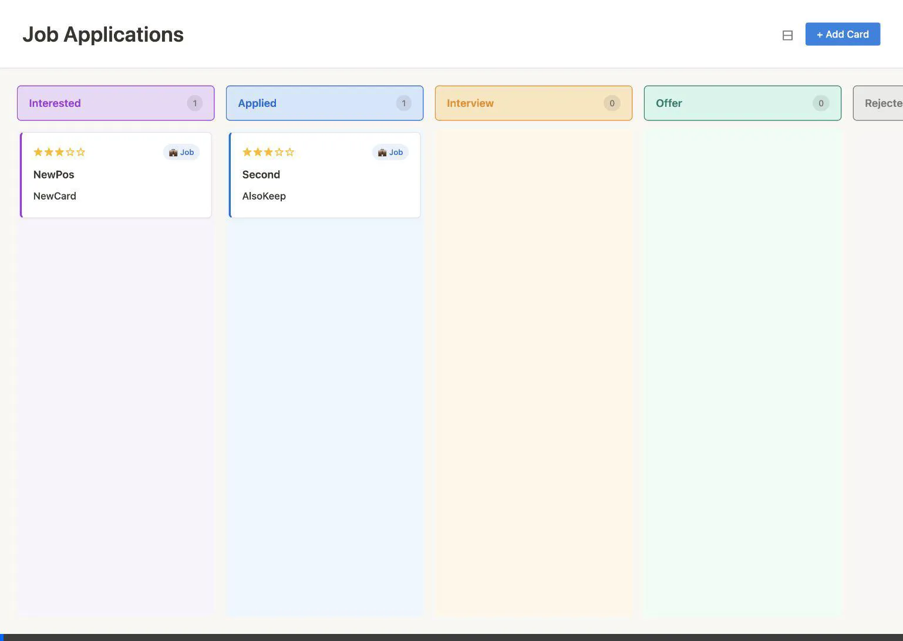

# Job Board - Personal Application Tracker



A minimalist Kanban board to track job applications and networking connections.

## Features

- 🤝 **Dual Entity System**: Track connections and job applications together
- ⭐ **Star Ratings**: 1-5 stars to prioritize opportunities
- 🎯 **Visual Badges**: Emoji icons and type badges for quick scanning
- 📋 **Kanban Workflow**: Drag-and-drop through 6 stages
- 🗜️ **Compact View**: Toggle between comfortable and compact card layouts
- 📝 **Markdown Comments**: Format notes with headings, lists, code, and more
- 🕐 **Timestamps**: Track when cards were created and last updated
- 💾 **Local Storage**: All data stays on your machine

## Quick Start

```bash
cd /Users/pachocamacho/personal-job-board
python3 server.py
```

Open **http://localhost:8000** in your browser.

> **Why a server?** Browsers block localStorage on `file://` URLs. The server enables proper data persistence.

## Usage

**Connections (🤝)**: Networking contacts that may lead to opportunities
- Fields: Contact Name, Organization, Company, Position, Location, Salary

**Jobs (💼)**: Formal applications to specific roles  
- Fields: Company, Position, Location, Salary

**Star Ratings**: Click a star (1-5) to set priority level

**Markdown Comments**: Write formatted notes using markdown syntax:
- Toggle between **Edit** and **Preview** modes
- Supports: headings, **bold**, _italic_, lists, `code`, links
- Perfect for interview notes, follow-ups, and progress tracking

**View Toggle**: Click the ⊟/⊞ button in the header to switch between:
- **Comfortable view** (⊟): Full-size cards with multi-line layout
- **Compact view** (⊞): Condensed cards (~50% smaller) for seeing more at once

**Workflow**: Interested → Applied → Forgotten → Interview → Offer → Rejected

> **Forgotten Column**: For applications that have been in "Applied" status for 2+ weeks with no response. Manually move stale cards here to keep your "Applied" column focused on fresh applications.

## Data Storage

Data lives in your browser's localStorage. To keep your data:
- Use the same browser
- Access via http://localhost:8000
- Don't clear browser data

**View in Chrome DevTools**: Application tab → Local Storage → http://localhost:8000

## Files

- `index.html` - Application UI
- `styles.css` - Design system
- `app.js` - Core logic
- `server.py` - Local HTTP server
- `AI-GUIDE.md` - Compact reference for AI-assisted development (token-efficient)
