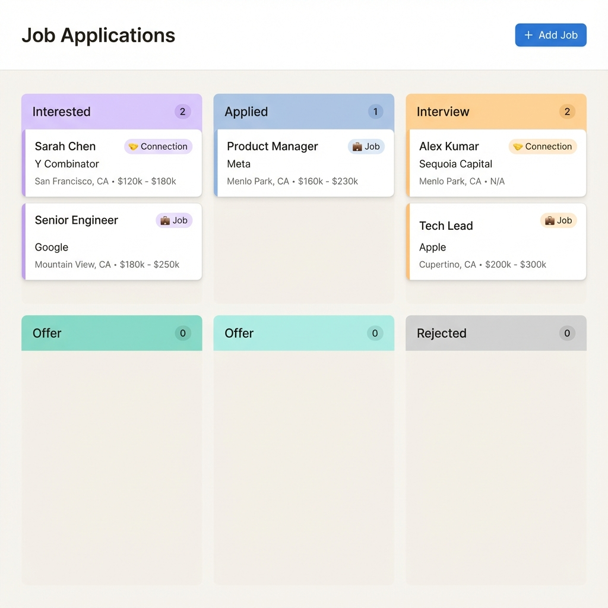
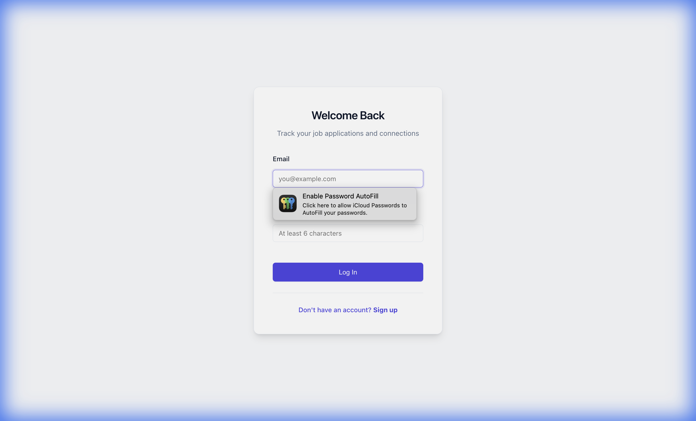
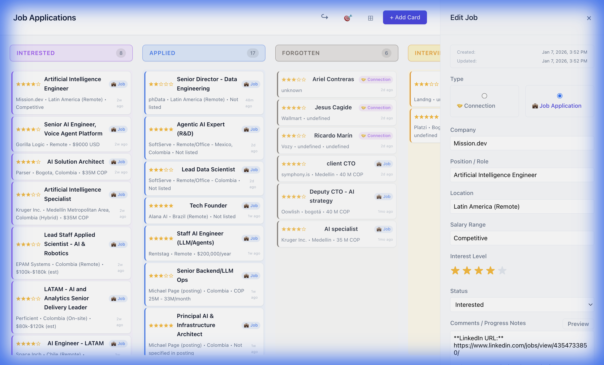

# Job Board - Personal Application Tracker




<div align="center">
  
  
</div>

A minimalist, **self-hosted Kanban board** to track job applications, networking opportunities, and business connections. Powered by **Docker**, **PostgreSQL**, and a secure **User Authentication** system.

## 🚀 Key Features

### 🏠 Home Dashboard
- **Upcoming Interviews**: Quick view of jobs in interview stage
- **New AI Matches**: Unseen jobs created by your AI agent
- **Unified Navigation**: Sidebar access to all boards

### 💼 Job Board
- **Kanban Columns**: Interested → Applied → Forgotten → Interview → **Pending** → Offer → Rejected (→ Archived)
- **Center Peek Modal**: Click any card to view detailed info with Journey Map
- **Journey Map Visualization**: Interactive SVG showing status progression over time
- **File Attachments**: Upload resumes, cover letters, PDFs, and images to any job
- **Job/Connection Types**: Track both networking and applications
- **AI Agent Integration**: Jobs created by AI agents are highlighted with a glow effect
- **Star Ratings**: Prioritize opportunities (1-5 stars)
- **Compact/Comfortable View**: Toggle between dense and detailed card layouts
- **Focus Mode 🎯**: Filter to high-priority items (hides low-rated cards and Rejected/Forgotten columns)
- **Archive Vault 📦**: Archive completed or old jobs to declutter your board while preserving history

### 🤝 Business Board
- **Track Business Relationships**: Investors, VCs, Accelerators, Connections
- **Kanban Stages**: Researching → Contacted → Meeting → Negotiation → Signed/Rejected
- **Color-Coded Columns**: Each stage has distinct visual styling
- **Drag & Drop**: Move entities between stages
- **File Attachments**: Upload pitch decks, contracts, or notes to any entity
- **Compact/Comfortable View**: Same view toggle as Job Board
- **Deep Linking**: Click jobs from Dashboard to open directly in Job Board with details visible

### 🔐 Authentication
- Secure signup/login with password hashing (bcrypt)
- JWT session tokens
- Per-user data isolation

## 🛠️ Tech Stack

- **Frontend**: Vanilla JS (ES6+), CSS3 Variables, Semantic HTML
- **Backend**: Node.js, Express, JWT Authentication
- **Database**: PostgreSQL 16
- **Infrastructure**: Docker Compose, Nginx (Reverse Proxy)

## 🏃 Quick Start

### Prerequisites
- Docker & Docker Compose installed

### 1. Clone & Configure
```bash
git clone https://github.com/pachocamacho1990/personal-job-board.git
cd personal-job-board
cp .env.example .env  # Edit with your settings
```

### 2. Start the Application
```bash
docker-compose up -d
```

### 3. Access the Job Board
Open your browser: **http://localhost/jobboard/**

### 4. Create an Account
1. Click **"Sign up"** on the login page
2. Create your account
3. You'll be redirected to your personal Dashboard

## 📁 Project Structure

```
personal-job-board/
├── public/                   # Frontend files
│   ├── index.html           # Dashboard (home)
│   ├── jobs.html            # Job Board
│   ├── business.html        # Business Board
│   ├── login.html           # Authentication
│   ├── styles.css           # Main stylesheet
│   ├── css/
│   │   ├── layout.css       # Dashboard layout
│   │   └── sidebar.css      # Navigation styles
│   └── js/
│       ├── shared/
│       │   ├── utils.js     # Shared utilities (escapeHtml, formatDate, etc.)
│       │   └── file-manager.js # File upload/preview/delete factory
│       ├── api.js           # API client
│       ├── app.js           # Job Board logic
│       ├── business.js      # Business Board logic
│       ├── dashboard.js     # Dashboard widgets
│       ├── sidebar.js       # Navigation
│       ├── logout.js        # Logout modal
│       └── auth.js          # Login/signup
├── server/                   # Backend API
│   ├── server.js            # Express entry point
│   ├── controllers/         # Request handlers
│   ├── routes/              # API routes
│   ├── middleware/          # Auth middleware
│   ├── models/              # Database schema
│   └── tests/               # Jest tests
├── docker-compose.yml       # Container orchestration
└── nginx/                   # Reverse proxy config
```

## 🔧 Management

### Stopping the App
```bash
docker-compose down
```
*(Your data persists in the Docker volume)*

### Viewing Logs
```bash
docker-compose logs -f api
```

### Rebuilding After Changes
```bash
docker-compose up -d --build
```

## 📦 Data Migration (from v1)

If you have data from the old localStorage version:

1. **Export**: Open old version console → run `scripts/export-from-localstorage.js`
2. **Import**:
   ```bash
   node scripts/import-to-database.js migration-data.json your@email.com yourpassword
   ```

See [DEPLOYMENT.md](DEPLOYMENT.md) for detailed migration steps.

## 🧪 Testing

```bash
# Run backend tests
cd server
npm test
```

Tests include:
- `auth.test.js` - Authentication flows
- `jobs.test.js` - Job CRUD operations
- `business.test.js` - Business entity CRUD
- `dashboard.test.js` - Summary data

See [TESTING.md](TESTING.md) for full testing strategy.

## 🗺️ API Endpoints

### Authentication
| Method | Endpoint | Description |
|--------|----------|-------------|
| POST | `/api/auth/signup` | Create account |
| POST | `/api/auth/login` | Get JWT token |
| GET | `/api/auth/me` | Get current user info |

### Jobs
| Method | Endpoint | Description |
|--------|----------|-------------|
| GET | `/api/jobs` | List all jobs |
| POST | `/api/jobs` | Create job |
| PUT | `/api/jobs/:id` | Update job |
| DELETE | `/api/jobs/:id` | Delete job |
| GET | `/api/jobs/:id/history` | Get status change history |
| GET | `/api/jobs/:id/files` | List job files |
| POST | `/api/jobs/:id/files` | Upload file to job |
| DELETE | `/api/jobs/:id/files/:fileId` | Delete job file |

### Business Entities
| Method | Endpoint | Description |
|--------|----------|-------------|
| GET | `/api/business` | List all entities |
| POST | `/api/business` | Create entity |
| PUT | `/api/business/:id` | Update entity |
| DELETE | `/api/business/:id` | Delete entity |
| GET | `/api/business/:id/files` | List entity files |
| POST | `/api/business/:id/files` | Upload file to entity |
| DELETE | `/api/business/:id/files/:fileId` | Delete entity file |

### Dashboard
| Method | Endpoint | Description |
|--------|----------|-------------|
| GET | `/api/dashboard/summary` | Get widget data |

### Health
| Method | Endpoint | Description |
|--------|----------|-------------|
| GET | `/api/health` | API health check |

## 📚 Documentation

- [CHANGELOG.md](CHANGELOG.md) - Version history and release notes
- [DEPLOYMENT.md](DEPLOYMENT.md) - Deployment and migration guide
- [TESTING.md](TESTING.md) - Testing strategy
- [CLAUDE.md](CLAUDE.md) - AI assistant codebase guide

## 📄 License
MIT
