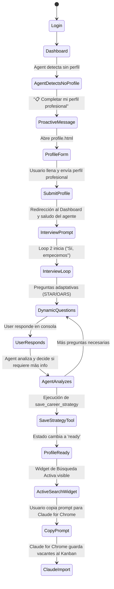
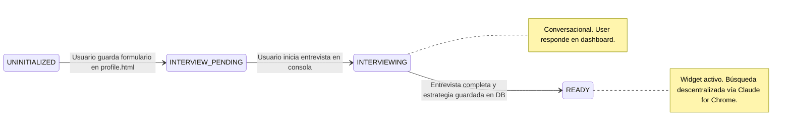
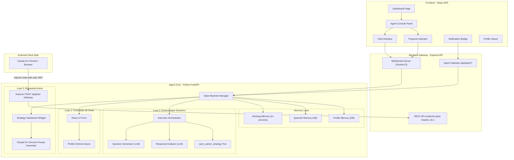

# Zenith AI Agent — Arquitectura Agentic v3

## 🎯 Visión Revisada

El Zenith Agent es un **sistema agentic de 3 loops** interactivo y descentralizado que construye inteligencia progresivamente:

```
┌─────────────────────────────────────────────────────────────────┐
│                    ZENITH AGENT LIFECYCLE                        │
│                                                                  │
│   Loop 1: Formulario de Perfil     (Web Onboarding, React Form)  │
│           ↓ output: profile_data                                 │
│   Loop 2: Entrevistador Dinámico   (Conversacional, con user)    │
│           ↓ output: career_strategy + search_prompt              │
│   Loop 3: Búsqueda Activa          (Descentralizado, Claude)     │
│           ↓ output: matched jobs → Kanban board                  │
└─────────────────────────────────────────────────────────────────┘
```

> [!IMPORTANT]
> **Enfoque de Búsqueda y Onboarding**: El System Prompt y el perfil profesional se inicializan mediante un formulario React moderno, se enriquecen conversacionalmente a través de un diálogo basado en Schein y Korn Ferry (STAR/OARS), y la búsqueda de empleo se delega de forma descentralizada a la extensión local Claude for Chrome mediante el copiado de prompts dinámicos.

---

## 🔄 Flujo Completo del Usuario



### Estados del Agente (State Machine)




---

## 🏗️ Arquitectura Técnica Completa v2




---

## 📐 Diseño Detallado por Loop

### Loop 1: Formulario de Perfil Profesional (Web Onboarding)

**Trigger**: El agente detecta que no hay perfil y muestra el botón `📋 Completar mi perfil profesional`.
**Ejecución**: El usuario completa sus datos profesionales en `/jobboard/profile.html`.
**Output**: `profile_data` guardado en la base de datos y transición a estado `interview_pending`.

---

### Loop 2: Interview Conductor (Conversacional)

**Trigger**: Agente detecta `estado = INTERVIEW_PENDING` y user inicia conversación.
**Ejecución**: Interactiva en el chat del Dashboard. El agente pregunta, el user responde.
**Output**: `career_strategy` + `search_prompt` en la DB.

#### Diseño de la Entrevista

```
┌─────────────────────────────────────────────────────────────────┐
│  LOOP 2: INTERVIEW CONDUCTOR                                    │
│                                                                  │
│  El agente ya tiene el profile_data del formulario.              │
│  Ahora necesita entender lo que el perfil inicial no dice:       │
│                                                                  │
│  BLOQUE 1: Validación del Perfil (2-3 preguntas)                │
│    → "Vi que trabajaste en Company X como ML Engineer.           │
│       ¿Cuál fue tu mayor logro técnico ahí?"                    │
│                                                                  │
│  BLOQUE 2: Preferencias Profesionales (3-4 preguntas)           │
│    → "¿Qué tipo de rol buscas? ¿IC, Tech Lead, Manager?"       │
│    → "¿Preferencia de modalidad? Remoto, híbrido, presencial"   │
│    → "¿Rango salarial esperado?"                                │
│                                                                  │
│  BLOQUE 3: Fit Cultural y Psicológico (2-3 preguntas)           │
│    → \"Si tuvieras que elegir entre mayor salario o mejor         │
│       equipo técnico, ¿cuál priorizas?\"                         │
│                                                                  │
│  Las preguntas son DINÁMICAS. El agente decide la siguiente      │
│  pregunta basándose en las respuestas anteriores. No es un       │
│  formulario fijo.                                                │
│                                                                  │
│  Al final, el agente permite construir:                           │
│  1. enriched_profile (perfil completo estructurado)              │
│  2. career_strategy (resumen de la estrategia de búsqueda)       │
│  3. search_parameters (parámetros concretos para Loop 3)         │
└─────────────────────────────────────────────────────────────────┘
```

#### Lo que sugiere el agente proactivamente:

> [!TIP]
> **El valor diferenciador**: El agente no solo pregunta qué quiere el user — **sugiere caminos que el user no ha considerado**. Esto es lo que hace un buen recruiter. Ejemplo: "Veo que tienes 4 años de experiencia en data pipelines y 2 en ML. Los roles de 'ML Platform Engineer' combinan ambos y pagan 20% más que ML Engineer puro. ¿Te interesa que busque en esa dirección también?"

---

### Loop 3: Job Search Orchestrator (Background + Notificaciones)

**Trigger**: Solo disponible cuando `estado = READY`.
**Ejecución**: Background con notificaciones. User puede configurar frecuencia.
**Output**: Job cards creadas automáticamente en el Kanban board.

> [!NOTE]
> Este loop es esencialmente el que busca activamente vacantes según tu perfil profesional estructurado y las inyecta en el pipeline.

---

## 💾 Schema de Base de Datos

Las tablas y esquemas reales del microservicio del agente Zenith AI se encuentran detallados en el archivo [AGENT_PRD_TECH_SPEC.md](file:///Users/pacho-home-server/personal-job-board/docs/AGENT_PRD_TECH_SPEC.md#L127-L196) (Sección 4. Esquema de Base de Datos y Datos Persistentes).


---

## 🖥️ Diseño del Dashboard UI — Agent Console

### Layout del Dashboard Modificado

```
┌──────────────────────────────────────────────────────────────────────────┐
│  [≡] Zenith                                        🔔 3  👤 Pacho      │
├──────────┬───────────────────────────────────────────┬───────────────────┤
│          │                                           │                   │
│ SIDEBAR  │         MAIN CONTENT                      │  AGENT CONSOLE    │
│          │                                           │                   │
│ 🏠 Dash  │  Welcome back, Pacho                     │  🧠 Zenith Agent  │
│ 📋 Jobs  │                                           │  ● Online         │
│ 💼 Biz   │  ┌──────────────┐ ┌──────────────┐       │                   │
│ 📄 Docs  │  │ 📅 Interviews │ │ 🤖 AI Matches│       │  Agent: ¡Hola!    │
│          │  │              │ │              │       │  Noté que aún no  │
│ ── ── ── │  │  3 upcoming  │ │  5 new       │       │  tengo contexto   │
│ Boards:  │  │              │ │              │       │  de tu perfil.    │
│ > ML Q3  │  └──────────────┘ └──────────────┘       │  ¿Quieres que     │
│ > Gen    │                                           │  investigue tu    │
│          │  ┌──────────────┐ ┌──────────────┐       │  LinkedIn?        │
│          │  │ 📊 Pipeline   │ │ 🎯 Match Rate│       │                   │
│          │  │              │ │              │       │  [ Sí, dale ]     │
│          │  │  12 active   │ │    78%       │       │  [ No por ahora ] │
│          │  └──────────────┘ └──────────────┘       │                   │
│          │                                           │  ─ ─ ─ ─ ─ ─ ─   │
│          │                                           │  [  Escribe... ➤] │
├──────────┴───────────────────────────────────────────┴───────────────────┤
│  ⚡ Agent: Investigando perfil LinkedIn... 78%                    [ver]  │
└──────────────────────────────────────────────────────────────────────────┘
```

> [!NOTE]
> **El Agent Console es un panel lateral derecho persistente** que aparece en el Dashboard. No es una página separada. El usuario puede contraerlo/expandirlo. El banner inferior aparece cuando hay un proceso background activo, **visible en TODAS las páginas de la app** (Jobs, Business, etc.), similar a una barra de descarga.

### Componentes React Nuevos

| Componente | Ubicación | Función |
|---|---|---|
| `AgentConsole.tsx` | Panel lateral derecho en Dashboard | Contenedor principal del chat con el agente |
| `AgentChat.tsx` | Dentro de AgentConsole | Interfaz de mensajes (chat bubbles) |
| `AgentProgress.tsx` | Dentro de AgentConsole | Barra de progreso + steps para procesos background |
| `AgentToolCall.tsx` | Dentro del chat | Bloque expandible que muestra tool usage |
| `AgentThinking.tsx` | Dentro del chat | Bloque de "pensamiento" del agente (chain of thought) |
| `AgentStatusBar.tsx` | Footer global de la app | Banner persistente cuando hay procesos activos |
| `AgentNotificationBadge.tsx` | Header de la app | Badge con count de notificaciones del agente |
| `ProfileViewer.tsx` | Modal/página | Vista del perfil profesional construido |

---

## 🧠 Tipos de Memoria Revisados

| Tipo | Qué guarda | Cómo se construye | Dónde vive |
|---|---|---|---|
| **Profile Memory** | Perfil profesional completo del user | Loop 1 (LinkedIn) + Loop 2 (Entrevista) | `agent_profiles.enriched_profile` |
| **Conversation Memory** | Historial de chat con el agente | Cada interacción se guarda | `agent_messages` table |
| **Working Memory** | Contexto de la tarea activa del agente | Se construye al inicio de cada loop | In-memory (Python dict) |
| **Episodic Memory** | Historial de runs: qué buscó, qué encontró | Se guarda al final de cada run | `agent_runs` table |
| **Semantic Memory** | Embeddings de perfil, jobs, companies | Se genera con cada nuevo dato | `agent_embeddings` (pgvector) |
| **Workspace Memory** | Jobs, boards, connections del user | Ya existe en la DB | PostgreSQL (tablas existentes) |

> [!IMPORTANT]
> **System Prompt dinámico**: El system prompt del agente se construye en runtime combinando: `enriched_profile` + `career_strategy` + estado actual del workspace (cuántos jobs activos, en qué stage, últimas búsquedas). Esto es lo que hace que el agente sea contextualmente inteligente y no un chatbot genérico.
