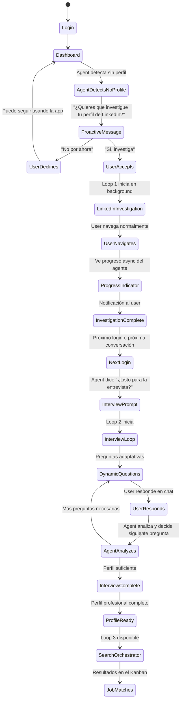
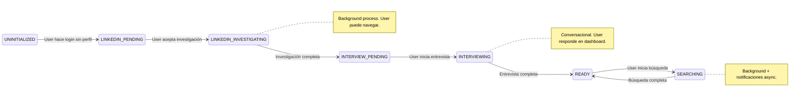
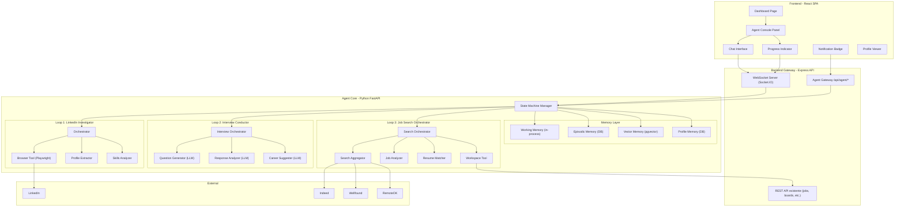

# Zenith AI Agent — Arquitectura Agentic v2

## 🎯 Visión Revisada

El Zenith Agent no es un chatbot con formularios. Es un **sistema agentic de 3 loops** que construye inteligencia progresivamente:

```
┌─────────────────────────────────────────────────────────────────┐
│                    ZENITH AGENT LIFECYCLE                        │
│                                                                  │
│   Loop 1: LinkedIn Investigator    (Background, autónomo)        │
│           ↓ output: raw_profile                                  │
│   Loop 2: Interview Conductor      (Conversacional, con user)    │
│           ↓ output: enriched_profile + career_strategy           │
│   Loop 3: Job Search Orchestrator  (Background + notificaciones) │
│           ↓ output: matched jobs → Kanban board                  │
└─────────────────────────────────────────────────────────────────┘
```

> [!IMPORTANT]
> **Cambio fundamental vs. v1**: El System Prompt/perfil profesional NO se llena con un formulario. Se **construye dinámicamente** a través de un proceso de onboarding agentic en 2 fases (investigación LinkedIn + entrevista profesional). Esto produce un perfil mucho más rico y preciso que cualquier formulario.

---

## 🔄 Flujo Completo del Usuario



### Estados del Agente (State Machine)



---

## 🏗️ Arquitectura Técnica Completa v2



---

## 📐 Diseño Detallado por Loop

### Loop 1: LinkedIn Investigator (Background Agent)

**Trigger**: User acepta el mensaje proactivo en el Dashboard.
**Ejecución**: 100% background. User navega normalmente.
**Output**: `raw_profile` estructurado en la DB.

#### Qué hace el agente paso a paso:

```
┌─────────────────────────────────────────────────────────────────┐
│  LOOP 1: LINKEDIN INVESTIGATOR                                  │
│                                                                  │
│  Pre-requisito: User provee sus credenciales de LinkedIn         │
│  (o ya tiene sesión activa en el browser del servidor)           │
│                                                                  │
│  Step 1: NAVIGATE                                                │
│    → Playwright abre LinkedIn con las credenciales del user      │
│    → WebSocket: "🔍 Accediendo a tu perfil de LinkedIn..."       │
│                                                                  │
│  Step 2: EXTRACT PROFILE HEADER                                  │
│    → Nombre, título actual, ubicación, foto                      │
│    → WebSocket: "📋 Encontré: Senior ML Engineer at Company X"   │
│                                                                  │
│  Step 3: EXTRACT EXPERIENCE                                      │
│    → Scroll por toda la sección de experiencia                   │
│    → Extraer cada posición: empresa, rol, período, descripción   │
│    → WebSocket: "💼 Extrayendo experiencia... 5 posiciones"      │
│                                                                  │
│  Step 4: EXTRACT SKILLS & ENDORSEMENTS                           │
│    → Navegar a la sección de skills                              │
│    → Listar skills con endorsement count                         │
│    → WebSocket: "🎯 32 skills encontradas. Top: Python (47)"     │
│                                                                  │
│  Step 5: EXTRACT EDUCATION                                       │
│    → Universidades, títulos, fechas                              │
│    → WebSocket: "🎓 Educación extraída: 2 instituciones"         │
│                                                                  │
│  Step 6: EXTRACT RECOMMENDATIONS                                 │
│    → Texto de recomendaciones recibidas                          │
│    → WebSocket: "⭐ 8 recomendaciones encontradas"               │
│                                                                  │
│  Step 7: EXTRACT CERTIFICATIONS & COURSES                        │
│    → WebSocket: "📜 3 certificaciones encontradas"               │
│                                                                  │
│  Step 8: ANALYZE & STRUCTURE                                     │
│    → LLM procesa toda la data cruda en perfil estructurado       │
│    → Genera embeddings del perfil completo                       │
│    → WebSocket: "✅ Perfil completo. 8 años de experiencia,      │
│                     32 skills, especialización en ML/AI"          │
│                                                                  │
│  Step 9: SAVE & NOTIFY                                           │
│    → Guarda raw_profile en agent_profiles                        │
│    → Actualiza estado: LINKEDIN_INVESTIGATING → INTERVIEW_PENDING│
│    → Notificación: "Tu perfil de LinkedIn fue investigado con    │
│      éxito. Cuando estés listo, iniciaremos la entrevista."      │
└─────────────────────────────────────────────────────────────────┘
```

#### Lo que ve el usuario en el Dashboard mientras tanto:

```
┌─────────────────────────────────────────────────────────────┐
│  🧠 Zenith Agent                                     ● Live │
│ ─────────────────────────────────────────────────────────── │
│                                                              │
│  Agent: ¡Hola! Noté que aún no tengo contexto de tu         │
│  perfil profesional. ¿Quieres que investigue tu LinkedIn     │
│  para entender tu experiencia y skills?                      │
│                                                              │
│  You: Sí, dale                                               │
│                                                              │
│  Agent: Perfecto. Iniciando investigación de perfil...       │
│                                                              │
│  ┌─────────────────────────────────────────────────────┐    │
│  │  📊 Investigación de Perfil LinkedIn                 │    │
│  │  ━━━━━━━━━━━━━━━━━━━━━━━━━━━━━━━━━━━░░░░ 78%       │    │
│  │                                                      │    │
│  │  ✅ Perfil header extraído                           │    │
│  │  ✅ Experiencia laboral (5 posiciones)               │    │
│  │  ✅ Skills y endorsements (32 skills)                │    │
│  │  ✅ Educación (2 instituciones)                      │    │
│  │  🔄 Extrayendo recomendaciones...                    │    │
│  │  ○  Certificaciones                                  │    │
│  │  ○  Análisis final                                   │    │
│  └─────────────────────────────────────────────────────┘    │
│                                                              │
│  ─ ─ ─ ─ ─ ─ ─ ─ ─ ─ ─ ─ ─ ─ ─ ─ ─ ─ ─ ─ ─ ─ ─ ─ ─ ─  │
│  [  Escribe un mensaje...                            📎 ➤ ] │
└─────────────────────────────────────────────────────────────┘
```

> [!NOTE]
> **UX clave**: El usuario puede navegar a Jobs Board, Business Board, etc. mientras el agente investiga. El progress indicator es un badge persistente en el Sidebar/Header que muestra el estado actual. Similar a como ves el chain-of-thought de un agente en Cursor/Claude.

---

### Loop 2: Interview Conductor (Conversacional)

**Trigger**: Agente detecta `estado = INTERVIEW_PENDING` y user inicia conversación.
**Ejecución**: Interactiva en el chat del Dashboard. El agente pregunta, el user responde.
**Output**: `enriched_profile` + `career_strategy` en la DB.

#### Diseño de la Entrevista

```
┌─────────────────────────────────────────────────────────────────┐
│  LOOP 2: INTERVIEW CONDUCTOR                                    │
│                                                                  │
│  El agente ya tiene el raw_profile de LinkedIn.                  │
│  Ahora necesita entender lo que LinkedIn NO dice:                │
│                                                                  │
│  BLOQUE 1: Validación del Perfil (2-3 preguntas)                │
│    → "Vi que trabajaste 3 años en Company X como ML Engineer.    │
│       ¿Cuál fue tu mayor logro técnico ahí?"                    │
│    → "Tus top skills en LinkedIn son Python y PyTorch.           │
│       ¿Hay algún skill que no esté ahí pero domines?\"           │
│                                                                  │
│  BLOQUE 2: Preferencias Profesionales (3-4 preguntas)           │
│    → \"¿Qué tipo de rol buscas? ¿IC, Tech Lead, Manager?\"       │
│    → \"¿Preferencia de modalidad? Remoto, híbrido, presencial\"   │
│    → \"¿Rango salarial esperado?\"                                │
│    → \"¿Disposición a reubicarte? ¿A dónde?\"                    │
│                                                                  │
│  BLOQUE 3: Fit Cultural y Psicológico (2-3 preguntas)           │
│    → \"¿Qué valoras más en un equipo de trabajo?\"                │
│    → \"¿Prefieres empresas en etapa temprana o corporativos?\"    │
│    → \"¿Qué te hizo dejar tu último trabajo?\"                   │
│                                                                  │
│  BLOQUE 4: Career Path Exploration (2-3 preguntas, adaptivas)  │
│    → El agente ANALIZA el perfil y SUGIERE caminos              │
│    → \"Con tu experiencia en ML y tu interés en producto,         │
│       has considerado roles de ML Product Manager? Están         │
│       pagando $180-220k y tu perfil es un fit natural.\"         │
│    → \"Veo que tienes experiencia en infraestructura.             │
│       Los roles de MLOps/Platform están en alta demanda.\"       │
│                                                                  │
│  BLOQUE 5: Deal Breakers y Prioridades (1-2 preguntas)         │
│    → \"¿Hay algo que sea un NO absoluto para ti?\"                │
│    → \"Si tuvieras que elegir entre mayor salario o mejor         │
│       equipo técnico, ¿cuál priorizas?\"                         │
│                                                                  │
│  Las preguntas son DINÁMICAS. El agente decide la siguiente      │
│  pregunta basándose en las respuestas anteriores. No es un       │
│  formulario fijo.                                                │
│                                                                  │
│  Al final, el agente permite construir:                           │
│  1. enriched_profile (perfil completo estructurado)              │
│  2. career_strategy (resumen de la estrategia de búsqueda)       │
│  3. search_parameters (parámetros concretos para Loop 3)         │
└─────────────────────────────────────────────────────────────────┘
```

#### Lo que sugiere el agente proactivamente:

> [!TIP]
> **El valor diferenciador**: El agente no solo pregunta qué quiere el user — **sugiere caminos que el user no ha considerado**. Esto es lo que hace un buen recruiter. Ejemplo: "Veo que tienes 4 años de experiencia en data pipelines y 2 en ML. Los roles de 'ML Platform Engineer' combinan ambos y pagan 20% más que ML Engineer puro. ¿Te interesa que busque en esa dirección también?"

---

### Loop 3: Job Search Orchestrator (Background + Notificaciones)

**Trigger**: Solo disponible cuando `estado = READY`.
**Ejecución**: Background con notificaciones. User puede configurar frecuencia.
**Output**: Job cards creadas automáticamente en el Kanban board.

> [!NOTE]
> Este loop es esencialmente el que busca activamente vacantes según tu perfil profesional estructurado y las inyecta en el pipeline.

---

## 💾 Schema de Base de Datos (Nuevas Tablas)

```sql
-- ============================================
-- ZENITH AGENT DATABASE EXTENSIONS
-- ============================================

-- Extensión para vector similarity search
CREATE EXTENSION IF NOT EXISTS vector;

-- ────────────────────────────────────────────
-- Agent Profile (construido por onboarding)
-- ────────────────────────────────────────────
CREATE TABLE agent_profiles (
    id SERIAL PRIMARY KEY,
    user_id INTEGER UNIQUE REFERENCES users(id) ON DELETE CASCADE,
    
    -- Estado del onboarding
    onboarding_status VARCHAR(30) DEFAULT 'uninitialized'
        CHECK (onboarding_status IN (
            'uninitialized',           -- Sin perfil
            'linkedin_pending',        -- Esperando aceptación del user
            'linkedin_investigating',  -- Investigando LinkedIn
            'interview_pending',       -- LinkedIn listo, esperando entrevista
            'interviewing',            -- Entrevista en progreso
            'ready',                   -- Perfil completo, listo para buscar
            'searching'                -- Búsqueda activa
        )),
    
    -- Perfil crudo extraído de LinkedIn (JSON completo)
    linkedin_raw JSONB,
    
    -- Perfil enriquecido post-entrevista (JSON estructurado)
    enriched_profile JSONB,
    -- Ejemplo de enriched_profile:
    -- {
    --   "name": "Francisco Camacho",
    --   "title": "Senior ML Engineer",
    --   "years_experience": 8,
    --   "skills": { "primary": [...], "secondary": [...], "emerging": [...] },
    --   "experience": [{ "company": "...", "role": "...", "highlights": [...] }],
    --   "education": [...],
    --   "certifications": [...],
    --   "career_goals": { "target_roles": [...], "industries": [...] },
    --   "preferences": { "remote": true, "salary_range": { "min": 120000 } },
    --   "cultural_fit": { "values": [...], "company_stage": "startup" },
    --   "deal_breakers": [...],
    --   "agent_suggestions": { "alternative_paths": [...] }
    -- }
    
    -- Estrategia de búsqueda generada por el agente
    career_strategy JSONB,
    
    -- Parámetros de búsqueda concretos para Loop 3
    search_parameters JSONB,
    
    -- LinkedIn credentials (encrypted)
    linkedin_session_data JSONB,
    
    created_at TIMESTAMP DEFAULT NOW(),
    updated_at TIMESTAMP DEFAULT NOW()
);

-- ────────────────────────────────────────────
-- Agent Conversations (sesiones de chat)
-- ────────────────────────────────────────────
CREATE TABLE agent_conversations (
    id SERIAL PRIMARY KEY,
    user_id INTEGER REFERENCES users(id) ON DELETE CASCADE,
    conversation_type VARCHAR(30)
        CHECK (conversation_type IN (
            'onboarding_linkedin',  -- Loop 1: Investigación LinkedIn
            'onboarding_interview', -- Loop 2: Entrevista profesional
            'search_session',       -- Loop 3: Sesión de búsqueda
            'general'               -- Conversación libre con el agente
        )),
    status VARCHAR(20) DEFAULT 'active'
        CHECK (status IN ('active', 'completed', 'paused', 'cancelled')),
    metadata JSONB,  -- Datos específicos del tipo de conversación
    started_at TIMESTAMP DEFAULT NOW(),
    completed_at TIMESTAMP
);

-- ────────────────────────────────────────────
-- Agent Messages (mensajes individuales)
-- ────────────────────────────────────────────
CREATE TABLE agent_messages (
    id SERIAL PRIMARY KEY,
    conversation_id INTEGER REFERENCES agent_conversations(id) ON DELETE CASCADE,
    role VARCHAR(10) CHECK (role IN ('agent', 'user', 'system', 'tool')),
    content TEXT NOT NULL,
    
    -- Para mensajes de tipo 'tool': qué herramienta se usó
    tool_name VARCHAR(50),
    tool_input JSONB,
    tool_output JSONB,
    
    -- Para mensajes de progreso (chain of thought visible)
    message_type VARCHAR(20) DEFAULT 'chat'
        CHECK (message_type IN (
            'chat',           -- Mensaje normal de conversación
            'thinking',       -- Chain of thought del agente (visible al user)
            'tool_call',      -- El agente está ejecutando una herramienta
            'tool_result',    -- Resultado de la herramienta
            'progress',       -- Update de progreso (barra de progreso)
            'notification',   -- Notificación proactiva del agente
            'suggestion'      -- Sugerencia de carrera del agente
        )),
    
    created_at TIMESTAMP DEFAULT NOW()
);

CREATE INDEX idx_messages_conversation ON agent_messages(conversation_id);
CREATE INDEX idx_messages_created ON agent_messages(created_at);

-- ────────────────────────────────────────────
-- Agent Runs (ejecuciones de background)
-- ────────────────────────────────────────────
CREATE TABLE agent_runs (
    id SERIAL PRIMARY KEY,
    user_id INTEGER REFERENCES users(id) ON DELETE CASCADE,
    conversation_id INTEGER REFERENCES agent_conversations(id),
    
    run_type VARCHAR(30)
        CHECK (run_type IN (
            'linkedin_investigation',
            'interview_session',
            'job_search',
            'job_analysis',
            'market_research'
        )),
    
    status VARCHAR(20) DEFAULT 'pending'
        CHECK (status IN ('pending', 'running', 'completed', 'failed', 'cancelled')),
    
    -- Progreso trackeable
    progress_pct INTEGER DEFAULT 0 CHECK (progress_pct >= 0 AND progress_pct <= 100),
    progress_steps JSONB,  -- Array de steps con status
    -- Ejemplo: [
    --   {"step": "extract_header", "status": "completed", "detail": "Senior ML Engineer"},
    --   {"step": "extract_experience", "status": "running", "detail": "3/5 positions..."},
    --   {"step": "extract_skills", "status": "pending"}
    -- ]
    
    input_params JSONB,
    output_data JSONB,
    error_message TEXT,
    
    tokens_used INTEGER DEFAULT 0,
    cost_usd DECIMAL(10,4) DEFAULT 0,
    
    started_at TIMESTAMP DEFAULT NOW(),
    completed_at TIMESTAMP
);

-- ────────────────────────────────────────────
-- Agent Embeddings (vector search)
-- ────────────────────────────────────────────
CREATE TABLE agent_embeddings (
    id SERIAL PRIMARY KEY,
    user_id INTEGER REFERENCES users(id) ON DELETE CASCADE,
    source_type VARCHAR(50),  -- 'profile', 'job_posting', 'company', 'skill'
    source_id VARCHAR(255),
    content TEXT,
    embedding vector(1536),
    metadata JSONB,
    created_at TIMESTAMP DEFAULT NOW()
);

CREATE INDEX ON agent_embeddings
    USING ivfflat (embedding vector_cosine_ops)
    WITH (lists = 100);

-- ────────────────────────────────────────────
-- Agent Notifications
-- ────────────────────────────────────────────
CREATE TABLE agent_notifications (
    id SERIAL PRIMARY KEY,
    user_id INTEGER REFERENCES users(id) ON DELETE CASCADE,
    run_id INTEGER REFERENCES agent_runs(id),
    
    type VARCHAR(30) CHECK (type IN (
        'profile_ready',       -- Investigación LinkedIn completa
        'interview_ready',     -- Listo para entrevista
        'new_matches',         -- Nuevos job matches encontrados
        'market_insight',      -- Insight de mercado laboral
        'action_required',     -- Necesita input del user
        'search_complete'      -- Búsqueda completada
    )),
    
    title VARCHAR(255),
    body TEXT,
    action_url VARCHAR(255),   -- Deep link a la acción
    is_read BOOLEAN DEFAULT FALSE,
    created_at TIMESTAMP DEFAULT NOW()
);
```

---

## 🖥️ Diseño del Dashboard UI — Agent Console

### Layout del Dashboard Modificado

```
┌──────────────────────────────────────────────────────────────────────────┐
│  [≡] Zenith                                        🔔 3  👤 Pacho      │
├──────────┬───────────────────────────────────────────┬───────────────────┤
│          │                                           │                   │
│ SIDEBAR  │         MAIN CONTENT                      │  AGENT CONSOLE    │
│          │                                           │                   │
│ 🏠 Dash  │  Welcome back, Pacho                     │  🧠 Zenith Agent  │
│ 📋 Jobs  │                                           │  ● Online         │
│ 💼 Biz   │  ┌──────────────┐ ┌──────────────┐       │                   │
│ 📄 Docs  │  │ 📅 Interviews │ │ 🤖 AI Matches│       │  Agent: ¡Hola!    │
│          │  │              │ │              │       │  Noté que aún no  │
│ ── ── ── │  │  3 upcoming  │ │  5 new       │       │  tengo contexto   │
│ Boards:  │  │              │ │              │       │  de tu perfil.    │
│ > ML Q3  │  └──────────────┘ └──────────────┘       │  ¿Quieres que     │
│ > Gen    │                                           │  investigue tu    │
│          │  ┌──────────────┐ ┌──────────────┐       │  LinkedIn?        │
│          │  │ 📊 Pipeline   │ │ 🎯 Match Rate│       │                   │
│          │  │              │ │              │       │  [ Sí, dale ]     │
│          │  │  12 active   │ │    78%       │       │  [ No por ahora ] │
│          │  └──────────────┘ └──────────────┘       │                   │
│          │                                           │  ─ ─ ─ ─ ─ ─ ─   │
│          │                                           │  [  Escribe... ➤] │
├──────────┴───────────────────────────────────────────┴───────────────────┤
│  ⚡ Agent: Investigando perfil LinkedIn... 78%                    [ver]  │
└──────────────────────────────────────────────────────────────────────────┘
```

> [!NOTE]
> **El Agent Console es un panel lateral derecho persistente** que aparece en el Dashboard. No es una página separada. El usuario puede contraerlo/expandirlo. El banner inferior aparece cuando hay un proceso background activo, **visible en TODAS las páginas de la app** (Jobs, Business, etc.), similar a una barra de descarga.

### Componentes React Nuevos

| Componente | Ubicación | Función |
|---|---|---|
| `AgentConsole.tsx` | Panel lateral derecho en Dashboard | Contenedor principal del chat con el agente |
| `AgentChat.tsx` | Dentro de AgentConsole | Interfaz de mensajes (chat bubbles) |
| `AgentProgress.tsx` | Dentro de AgentConsole | Barra de progreso + steps para procesos background |
| `AgentToolCall.tsx` | Dentro del chat | Bloque expandible que muestra tool usage |
| `AgentThinking.tsx` | Dentro del chat | Bloque de "pensamiento" del agente (chain of thought) |
| `AgentStatusBar.tsx` | Footer global de la app | Banner persistente cuando hay procesos activos |
| `AgentNotificationBadge.tsx` | Header de la app | Badge con count de notificaciones del agente |
| `ProfileViewer.tsx` | Modal/página | Vista del perfil profesional construido |

---

## 🧠 Tipos de Memoria Revisados

| Tipo | Qué guarda | Cómo se construye | Dónde vive |
|---|---|---|---|
| **Profile Memory** | Perfil profesional completo del user | Loop 1 (LinkedIn) + Loop 2 (Entrevista) | `agent_profiles.enriched_profile` |
| **Conversation Memory** | Historial de chat con el agente | Cada interacción se guarda | `agent_messages` table |
| **Working Memory** | Contexto de la tarea activa del agente | Se construye al inicio de cada loop | In-memory (Python dict) |
| **Episodic Memory** | Historial de runs: qué buscó, qué encontró | Se guarda al final de cada run | `agent_runs` table |
| **Semantic Memory** | Embeddings de perfil, jobs, companies | Se genera con cada nuevo dato | `agent_embeddings` (pgvector) |
| **Workspace Memory** | Jobs, boards, connections del user | Ya existe en la DB | PostgreSQL (tablas existentes) |

> [!IMPORTANT]
> **System Prompt dinámico**: El system prompt del agente se construye en runtime combinando: `enriched_profile` + `career_strategy` + estado actual del workspace (cuántos jobs activos, en qué stage, últimas búsquedas). Esto es lo que hace que el agente sea contextualmente inteligente y no un chatbot genérico.
