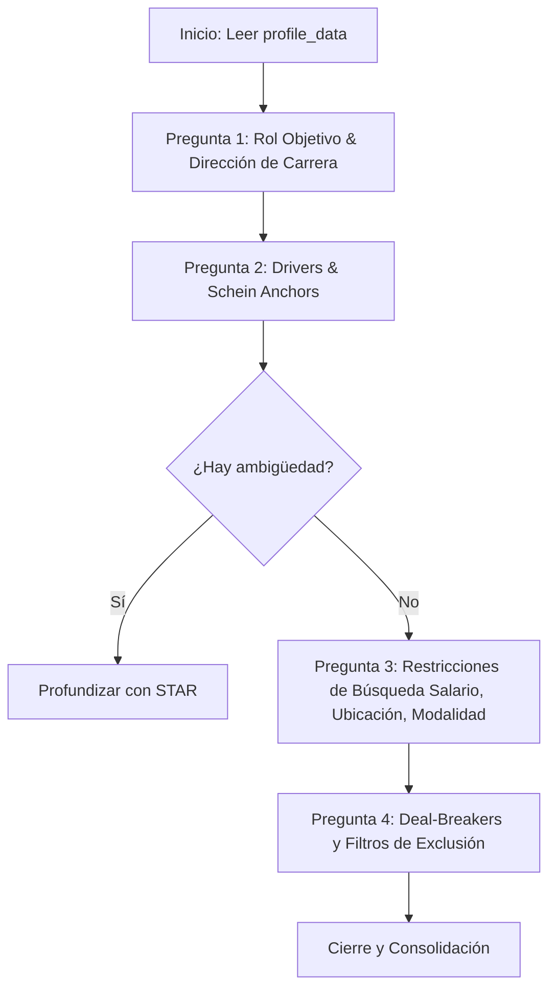

# Marco Teórico: Perfilamiento Profesional y Psicológico
## Sistema Agéntico de Entrevistas Zenith (Zenith Profiling Framework)

Este documento establece los fundamentos teóricos y metodológicos para el diseño del **Agente Entrevistador de Zenith**. Integra las mejores prácticas globales en psicología organizacional, reclutamiento ejecutivo de élite y técnicas de consejería conductual, adaptándolas a una arquitectura de agentes impulsada por Modelos de Lenguaje (LLMs).

---

## 🧭 1. Los Tres Pilares Metodológicos

Para ir más allá de un formulario seco de palabras clave, el Agente Zenith se estructura sobre tres marcos de referencia globales:

```
                      ┌─────────────────────────────────────────┐
                      │    ZENITH INTERVIEWING PILLARS          │
                      └────────────────────┬────────────────────┘
                                           │
         ┌─────────────────────────────────┼─────────────────────────────────┐
         ▼                                 ▼                                 ▼
 ┌───────────────┐                 ┌───────────────┐                 ┌───────────────┐
 │  KORN FERRY   │                 │ EDGAR SCHEIN  │                 │ ENTREVISTA    │
 │     KF4D      │                 │    ANCHORS    │                 │ MOTIVACIONAL  │
 ├───────────────┤                 ├───────────────┤                 ├───────────────┤
 │ Competencias, │                 │ Valores e     │                 │ OARS, Rapport │
 │ Experiencia,  │                 │ Impulsores    │                 │ y Resolución  │
 │ Rasgos y      │                 │ Profesionales │                 │ de            │
 │ Drivers.      │                 │ No-Negociables│                 │ Ambivalencia. │
 └───────────────┘                 └───────────────┘                 └───────────────┘
```

### Pilar 1: Korn Ferry KF4D (Las Cuatro Dimensiones del Éxito)
Basado en el modelo de evaluación de talento ejecutivo de Korn Ferry, el agente no evalúa únicamente "lo que el usuario ha hecho", sino su **potencial y adaptabilidad**.
*   **Competencias (Skills & Behaviors):** Habilidades observables de liderazgo, resolución de problemas y ejecución técnica.
*   **Experiencias (Track Record):** Roles del pasado, tamaño de equipos liderados, proyectos críticos (creación desde cero, reestructuración, escala de sistemas).
*   **Rasgos (Traits):** Disposición natural y personalidad en el trabajo (e.g., resiliencia ante la ambigüedad, curiosidad de aprendizaje, asertividad).
*   **Drivers (Motivaciones):** Lo que realmente energiza al usuario (e.g., estatus, autonomía, colaboración, impacto social).

### Pilar 2: Anclas de Carrera de Edgar Schein
Desarrollado en el MIT, este modelo de psicología organizacional define el **"ancla"** como la autoimagen profesional del usuario, la cual representa su núcleo duro e innegociable cuando debe tomar decisiones de carrera críticas. El agente Zenith identificará cuál de las 8 anclas domina al usuario para ajustar la estrategia y las directrices de búsqueda:
1.  **Competencia Técnica/Funcional:** Prioriza ser el experto técnico/funcional en su área.
2.  **Dirección General:** Desea liderar, integrar esfuerzos y tomar responsabilidad organizacional total.
3.  **Autonomía/Independencia:** Valora la libertad de definir cómo, cuándo y dónde trabaja.
4.  **Seguridad/Estabilidad:** Prefiere predictibilidad, contratos estables a largo plazo y consistencia.
5.  **Creatividad Emprendedora:** Necesidad inherente de crear productos o negocios propios desde cero.
6.  **Servicio/Dedicación a una Causa:** Guiado por valores éticos o impacto social (e.g., sustentabilidad, salud, educación).
7.  **Desafío Puro:** Se motiva resolviendo problemas extremadamente difíciles o compitiendo en entornos de alto rendimiento.
8.  **Estilo de Vida:** Prioriza la integración saludable del trabajo con su vida personal y familiar (balance real).

### Pilar 3: Entrevista Motivacional (Estilo Guía y OARS)
Para evitar que el agente parezca un interrogador de aduana, adopta el método de **Entrevista Motivacional (Motivational Interviewing)**. Este enfoque trata al usuario como el experto en su propia vida, reduciendo la fricción conversacional y resolviendo la ambivalencia mediante el modelo **OARS**:
*   **O (Open Questions):** Preguntas abiertas enfocadas en el "cómo" y el "por qué", evitando respuestas cerradas de sí/no.
*   **A (Affirmations):** Refuerzo de la autoeficacia del usuario reconociendo sus logros e hitos en la conversación.
*   **R (Reflective Listening):** El agente parafrasea y refleja el trasfondo de las respuestas del usuario para demostrar entendimiento profundo.
*   **S (Summaries):** Breves resúmenes periódicos para consolidar lo hablado antes de saltar al siguiente tema.

---

## 🎯 2. La Técnica de Indagación: El Método STAR Adaptativo

Cuando el agente necesite profundizar en la experiencia del usuario (por ejemplo, para validar sus habilidades de liderazgo o resiliencia), guiará la conversación sutilmente utilizando el método **STAR (Situation, Task, Action, Result)**:

*   **Situación:** *"¿Cuál era el contexto o problema técnico inicial?"*
*   **Tarea:** *"¿Qué debías resolver tú específicamente en ese escenario?"*
*   **Acción:** *"¿Qué pasos concretos tomaste (qué tecnologías usaste, cómo coordinaste al equipo)?"*
*   **Resultado:** *"¿Cuál fue el impacto cuantificable o el aprendizaje final (ahorro de costos, optimización de velocidad, entrega a tiempo)?"*

> [!TIP]
> **Interrogación Adaptativa:** Si el usuario da una respuesta vaga como *"Ayudé a migrar la infraestructura"*, el agente no la aceptará a la primera; usará un *follow-up prompt* dinámico: *"Entiendo. ¿Cuál fue tu rol exacto en esa migración y qué impacto tuvo en el rendimiento del sistema?"*

---

## 🤖 3. Arquitectura del Agente Entrevistador (Conversational Engine)

Para llevar este marco teórico a la práctica, el sistema agéntico debe estar diseñado bajo los siguientes parámetros de ejecución:

```
 ┌──────────────────────┐      ┌─────────────────────────┐      ┌───────────────────────┐
 │     INPUT: DB        │      │    AGENTE ZENITH (LLM)  │      │     OUTPUT: STRATEGY  │
 ├──────────────────────┤      ├─────────────────────────┤      ├───────────────────────┤
 │ profile_data (Fase 3)│ ───> │ * System Prompt KF4D    │ ───> │ * career_strategy     │
 │                      │      │ * Técnicas OARS / STAR  │      │ * search_prompt       │
 │                      │      │ * Estado: Interviewing  │      │ * Estado: Ready       │
 └──────────────────────┘      └─────────────────────────┘      └───────────────────────┘
```

### 3.1. Rol y System Prompt
El LLM debe ser instanciado con el rol de un **Consultor de Carrera Senior / Headhunter de Élite**. Sus respuestas deben ser:
*   **Empáticas pero directas:** Evitar la verborrea introductoria corporativa.
*   **Estructuradas:** Enfocadas en mapear secuencialmente las dimensiones clave (Drivers, Anclas de Carrera, Requisitos Duros).
*   **Contextualizadas:** El agente debe pre-cargar el `profile_data` del usuario. Si el usuario ya declaró 5 años en React, el agente no debe preguntar *"¿Sabes React?"*, sino *"Veo que llevas 5 años liderando proyectos en React. ¿Prefieres seguir en el stack web frontend puro o te gustaría expandirte hacia la arquitectura full-stack en tu próximo rol?"*.

### 3.2. Estructura Dinámica de Preguntas (Sequence Model)
El flujo de diálogo no debe ser un script lineal y estático, sino un árbol de decisiones con objetivos de extracción:



### 3.3. Detección de Finalización (Closure & Synthesis)
El agente debe evaluar activamente cuándo ha recopilado el contexto necesario para los 4 vectores (Competencias, Drivers, Restricciones y Ancla dominante).
1.  **Activación de Herramienta:** Cuando el agente determine que la entrevista está completa, ejecutará la herramienta de sistema `save_search_strategy`.
2.  **Payload del Output:** El payload generado por la herramienta debe mapear la estrategia a un JSON robusto:
    ```json
    {
      "dominant_anchor": "Lifestyle / Autonomy",
      "target_roles": ["Senior ML Engineer", "AI Solutions Architect"],
      "salary_preferences": {
        "target": 120000,
        "minimum": 95000,
        "currency": "EUR"
      },
      "work_mode": {
        "remote": true,
        "hybrid_ok": false,
        "travel_pct_max": 10
      },
      "geography": {
        "priorities": ["España", "Unión Europea (Remoto)"],
        "exclusions": ["EE.UU. (por huso horario)"]
      },
      "exclusions": {
        "industries": ["Cripto / Web3", "Apuestas online"],
        "companies": ["Acme Corp"]
      },
      "strategy_summary": "Ingeniero ML enfocado en el desarrollo de soluciones de IA generativa con preferencia estricta por roles remotos y estabilidad laboral. Prioriza balance de vida y entornos que no utilicen metodologías micro-managed."
    }
    ```
3.  **Transición de Estado:** Al guardarse con éxito este payload, la base de datos cambia automáticamente el estado del perfil de `interviewing` ➔ `ready`.

---

## 📈 4. Beneficios del Diseño
Al implementar la Fase 4 bajo este marco de trabajo, el producto Zenith ofrecerá:
*   **Instrucciones de Búsqueda de Alta Fidelidad (Fase 5):** Al conocer los *deal-breakers*, anclas de carrera y drivers reales, el agente construirá un **prompt altamente detallado** para que herramientas cliente (como Claude for Chrome) puedan navegar de manera autónoma buscando vacantes en LinkedIn, Indeed, etc., evaluando las coincidencias directamente en el navegador del usuario y cargándolas sin fricciones al Job Board respectivo en la app.
*   **Experiencia Premium de Usuario:** La interacción con el agente no se sentirá como llenar un cuestionario, sino como una sesión de coaching y estrategia profesional de alto valor.
