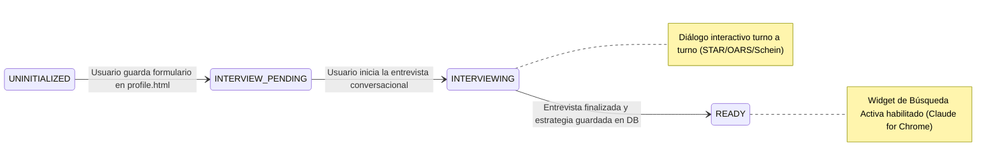
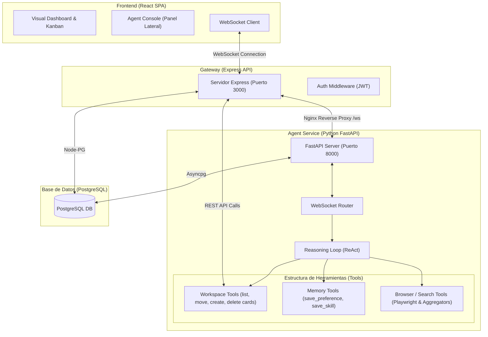

# Especificación Técnica y Requerimientos de Producto (PRD) — Zenith AI Agent

## 🎯 1. Resumen Ejecutivo y Objetivos

El **Zenith AI Agent** es un microservicio inteligente de automatización de carrera diseñado para integrarse de forma nativa en la plataforma **Zenith Job Board**. A diferencia de los chatbots tradicionales de preguntas y respuestas, Zenith Agent opera como un sistema cognitivo autónomo estructurado en **tres bucles de ejecución (loops)** que recopila información, perfila profesionalmente al usuario y orquesta de forma proactiva la búsqueda y catalogación de ofertas de empleo.

### Objetivos Principales:
*   **Onboarding Autónomo**: Eliminar los formularios estáticos de registro de perfil. El agente debe auto-construir el contexto profesional del usuario investigando fuentes públicas (LinkedIn) y realizando entrevistas adaptativas basadas en mejores prácticas de reclutamiento.
*   **Orquestación Proactiva (Loop 3)**: Automatizar la búsqueda de empleo en múltiples portales web y poblar de forma autónoma el Kanban del usuario con recomendaciones puntuadas por compatibilidad (Match Rate).
*   **Bucle de Aprendizaje Continuo**: Extraer preferencias y directrices en caliente de las conversaciones diarias para adaptar el prompt de sistema del agente en tiempo real.

---

## 👥 2. Requerimientos de Producto (PRD)

### 2.1. El Flujo de Onboarding en 3 Bucles

El ciclo de vida del agente se divide en tres fases funcionales obligatorias:

```
┌─────────────────────────────────────────────────────────────────┐
│                    ZENITH AGENT LIFECYCLE                        │
│                                                                  │
│   Loop 1: Investigador de LinkedIn (Background, autónomo)        │
│           ↓ Output: raw_profile (Historial, habilidades, cursos) │
│                                                                  │
│   Loop 2: Entrevistador Dinámico   (Conversacional, interactivo) │
│           ↓ Output: enriched_profile + Parámetros de búsqueda    │
│                                                                  │
│   Loop 3: Orquestador de Búsqueda  (Background, automatizado)    │
│           ↓ Output: Tarjetas de empleo en columna "Interested"   │
└─────────────────────────────────────────────────────────────────┘
```

#### Loop 1: Formulario de Perfil Profesional (Web Form Onboarding)
*   **Gatillo (Trigger)**: El agente detecta que el usuario no tiene perfil cargado y muestra un mensaje con el botón: `"📋 Completar mi perfil profesional"`.
*   **Comportamiento**: El usuario es redirigido a `/jobboard/profile.html` para rellenar su información (Nombre, titular, resumen, experiencia, educación, habilidades e idiomas). Se recomienda el uso de **Claude for Chrome** para agilizar el proceso de llenado a partir de su perfil de LinkedIn.
*   **Output**: Un objeto JSON estructurado guardado en la base de datos (`profile_data`) y transición de estado a `interview_pending`.

#### Loop 2: Entrevistador Dinámico (Perfilado Conversacional)
*   **Trigger**: Cambio de estado a `interview_pending`. El agente inicia el diálogo saludando y preguntando si está listo para comenzar.
*   **Comportamiento**: Un chat de entrevista dinámico donde el LLM evalúa lo que LinkedIn no dice:
    *   *Objetivos profesionales* (Tech Lead vs. IC, sector preferido).
    *   *Expectativas salariales* y *Modalidad* (Remoto, híbrido, relocalización).
    *   *Deal breakers* (Factores de rechazo inmediato como empresas Web3 o cryptos).
*   **Sugerencias Proactivas**: El LLM analiza el perfil y sugiere alternativas (ej: *"Tienes bases fuertes en infraestructura e IA. Roles de MLOps están pagando un 20% más que ML Engineer puro. ¿Busco también en esa dirección?"*).
*   **Output**: Generación de `enriched_profile` y actualización de estado a `ready`.

#### Loop 3: Orquestador de Búsqueda (Búsqueda Activa y Carga)
*   **Trigger**: El usuario pulsa `"🔍 Iniciar búsqueda"` o se dispara por medio de una tarea programada (cron).
*   **Comportamiento**: El agente busca vacantes reales en la web (LinkedIn Jobs, Indeed, Wellfound, etc.) usando los parámetros refinados del perfil.
*   **Clasificación**: Cada vacante encontrada se compara vectorialmente y semánticamente contra el perfil del usuario.
*   **Población del Kanban**: Las vacantes que superan el umbral de compatibilidad se insertan en la columna `interested` del tablero activo con la bandera `is_unseen = true` y `origin = 'agent'`.
*   **Output**: Notificaciones de nuevos matches y refresco en tiempo real de la UI mediante eventos del navegador.

---

## 🏗️ 3. Especificación Técnica

### 3.1. Arquitectura de Estado del Agente (State Machine)

El estado del perfil del usuario se rige por la siguiente máquina de estados controlada desde la base de datos PostgreSQL (`agent_profiles.onboarding_status`):




### 3.2. Arquitectura de Microservicios

La solución consta de la API Gateway en Express (Node.js) que maneja las sesiones de usuario y sirve la SPA en React, comunicada por WebSockets con el microservicio de IA en Python (FastAPI).



---

## 💾 4. Esquema de Base de Datos y Datos Persistentes

Las tablas del agente persisten el historial de mensajes, estados de onboarding, ejecuciones secundarias y directrices de aprendizaje:

### 4.1. Perfiles de Onboarding (`agent_profiles`)
Mantiene el estado y la metadata estructurada del perfil profesional.
```sql
CREATE TABLE agent_profiles (
    user_id INTEGER PRIMARY KEY REFERENCES users(id) ON DELETE CASCADE,
    onboarding_status VARCHAR(50) DEFAULT 'uninitialized'
        CHECK (onboarding_status IN (
            'uninitialized',
            'interview_pending',
            'interviewing',
            'ready',
            'searching'
        )),
    profile_data JSONB DEFAULT '{}'::jsonb,      -- Información del perfil profesional (nombre, experiencia, skills, etc.)
    career_strategy JSONB DEFAULT '{}'::jsonb,   -- Estrategia recomendada por la IA
    search_prompt TEXT,                          -- Prompt de búsqueda personalizado para Claude for Chrome
    updated_at TIMESTAMP DEFAULT CURRENT_TIMESTAMP
);
```

### 4.2. Mensajes del Agente (`agent_messages`)
Registra la conversación enriquecida con metadatos de progreso y ejecución de herramientas.
```sql
CREATE TABLE agent_messages (
    id SERIAL PRIMARY KEY,
    conversation_id INTEGER NOT NULL REFERENCES agent_conversations(id) ON DELETE CASCADE,
    role VARCHAR(50) NOT NULL, -- 'user', 'agent', 'system', 'tool'
    type VARCHAR(50) NOT NULL, -- 'chat', 'thinking', 'tool_call', 'tool_result', 'progress', 'action'
    content TEXT NOT NULL,
    tool_name VARCHAR(255),
    tool_input JSONB,
    tool_output JSONB,
    progress_pct INTEGER,
    progress_steps JSONB,
    actions JSONB,             -- Botones de acción incrustados
    timestamp TIMESTAMP DEFAULT CURRENT_TIMESTAMP
);
```

### 4.3. Memorias y Preferencias (`agent_memories`)
Guarda directrices y deal-breakers aprendidos dinámicamente del diálogo con el usuario.
```sql
CREATE TABLE agent_memories (
    id SERIAL PRIMARY KEY,
    user_id INTEGER NOT NULL REFERENCES users(id) ON DELETE CASCADE,
    category VARCHAR(50) NOT NULL, -- 'preference' (filtros), 'fact' (datos del usuario)
    content TEXT NOT NULL,
    created_at TIMESTAMP DEFAULT NOW(),
    updated_at TIMESTAMP DEFAULT NOW()
);
```

### 4.4. Skills Aprendidos (`agent_skills`)
Colección de flujos de trabajo (workflows) personalizados enseñados por el usuario.
```sql
CREATE TABLE agent_skills (
    id SERIAL PRIMARY KEY,
    user_id INTEGER NOT NULL REFERENCES users(id) ON DELETE CASCADE,
    name VARCHAR(100) NOT NULL,
    description TEXT NOT NULL,
    recipe JSONB NOT NULL,
    created_at TIMESTAMP DEFAULT NOW()
);
```

---

## ⚙️ 5. Protocolo de Comunicación (Eventos WebSocket)

La comunicación interactiva y en tiempo real a través de WebSockets utiliza el siguiente catálogo de eventos JSON:

### 5.1. Eventos del Cliente al Servidor (Inbound)
*   **Seleccionar Conversación**:
    ```json
    { "event": "select_conversation", "conversation_id": 12 }
    ```
*   **Nueva Conversación**:
    ```json
    { "event": "new_conversation" }
    ```
*   **Ejecutar Acción / Botón**:
    ```json
    { "event": "action", "action": "open_profile", "label": "📋 Completar mi perfil profesional" }
    ```
*   **Detener Inferencia (Cancelación)**:
    ```json
    { "event": "stop_generation" }
    ```

### 5.2. Eventos del Servidor al Cliente (Outbound)
*   **Historial de Mensajes**:
    ```json
    {
      "event": "history",
      "messages": [...],
      "onboardingStatus": "uninitialized",
      "conversationId": 12
    }
    ```
*   **Actualización de Mensajes (Stream)**:
    ```json
    { "event": "messages_update", "messages": [...] }
    ```
*   **Cambio de Estado de Onboarding**:
    ```json
    { "event": "onboarding_status_update", "status": "interview_pending" }
    ```
*   **Inferencia Iniciada / Detenida**:
    ```json
    { "event": "generation_started" }
    { "event": "generation_stopped" }
    ```

---

## 🏁 6. Hoja de Ruta de Implementación (Roadmap)

### [x] STAGE 1 — Consola Lateral UI y Mocks
*   Diseño responsivo del panel lateral derecho.
*   Chat interactivo con renderizado de burbujas (usuario, agente, herramientas, progress steps).
*   Visualización de barra de progreso y status bar global inferior.
*   Simulación de WebSockets y flujos de onboarding en React.

### [x] STAGE 2 — Microservicio Python e Integración de Herramientas
*   Conexión e infraestructura de FastAPI en Docker Compose.
*   Conexión a PostgreSQL y autenticación segura por JWT.
*   Bucle ReAct básico y ejecución de herramientas del espacio de trabajo (`list_jobs`, `update_job_status`, `archive_job`, `delete_job`).
*   Sincronización del Kanban mediante dispatch del evento `'workspace-updated'`.
*   Botón de stop en el frontend que cancela de forma asíncrona la tarea activa de Python (`asyncio.Task`).
*   Selector de historial de chats múltiples, borrado de conversaciones y títulos automáticos generados por IA.
*   Paginador y buscador dinámico integrados en el Archivo de tarjetas modal.
*   Auto-visto de recomendaciones de IA (`is_unseen = false`) al cambiar su columna o estado.

### [x] STAGE 3 — Formulario de Perfil Profesional (Loop 1)
*   Formulario interactivo modular y dinámico en React (`/jobboard/profile.html`).
*   Guardado del perfil preliminar (`profile_data` en Postgres) y transición de estado a `interview_pending`.
*   Envío del evento WebSocket `profile_saved` para alertar al agente en tiempo real.

### [x] STAGE 4 — Entrevistador Conversacional Inteligente (Loop 2)
*   Prompt del sistema para el LLM en modo Entrevistador ( Schein Schein anchors, Korn Ferry, STAR, OARS).
*   Interacción estructurada pregunta-respuesta en tiempo real en la consola de chat.
*   Herramienta `save_career_strategy` para guardar el perfil enriquecido, la estrategia estructurada y el prompt de búsqueda en la base de datos, con transición automática a estado `ready`.
*   Modo de prueba `TEST_MODE=true` determinista para simulaciones rápidas en E2E y pruebas unitarias de Python.

### [x] STAGE 5 — Búsqueda Descentralizada con Claude for Chrome (Loop 3)
*   Widget visual superior de Búsqueda Activa con chips de perfilado e inyección dinámica del Job Board en el prompt.
*   Copia fácil al portapapeles del prompt personalizado detallado para la extensión local Claude for Chrome.
*   Llamada directa autorizada mediante JWT al endpoint Express `POST /api/jobs` desde Claude for Chrome para poblar el Kanban de Zenith en la columna "Interested".
*   Pruebas completas de integración en Playwright simulando el onboarding, entrevista, copiado e importación de vacantes.

### [x] STAGE 6 — Refinamientos Avanzados (Bifurcación y Pensamiento Dinámico)
*   **Edición e Historial**: Edición del último mensaje del usuario desde el chat bubbles con un formulario de edición responsivo (redimensionable y con scrollbar).
*   **Regeneración en Cascada (Fork)**: Borrado de registros posteriores al mensaje editado en base de datos para prevenir contaminación del contexto del LLM.
*   **Prompt Único**: Regla estricta de flujo de una sola pregunta a la vez en la entrevista motivacional.
*   **Thinking Dinámico**: Feedback en tiempo real que describe la herramienta o acción del agente (ej. *"Analizando tu consulta..."*, *"Procesando resultados..."*, *"Consolidando preferencias..."*).
*   **Script de Reinicio de Entrevista**: Creación de `reset_interview.sh` para restaurar la entrevista conversacional sin limpiar los datos del formulario de perfil profesional.
